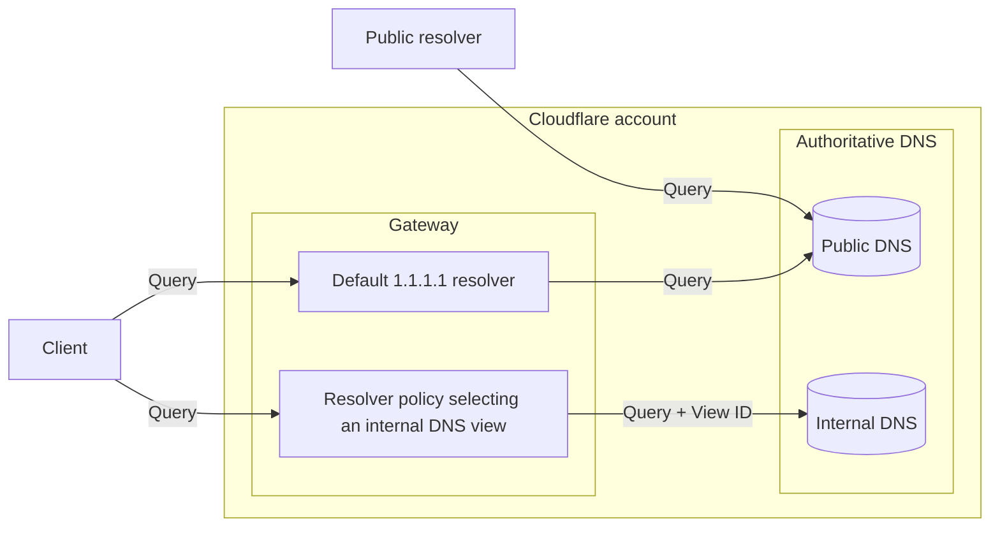
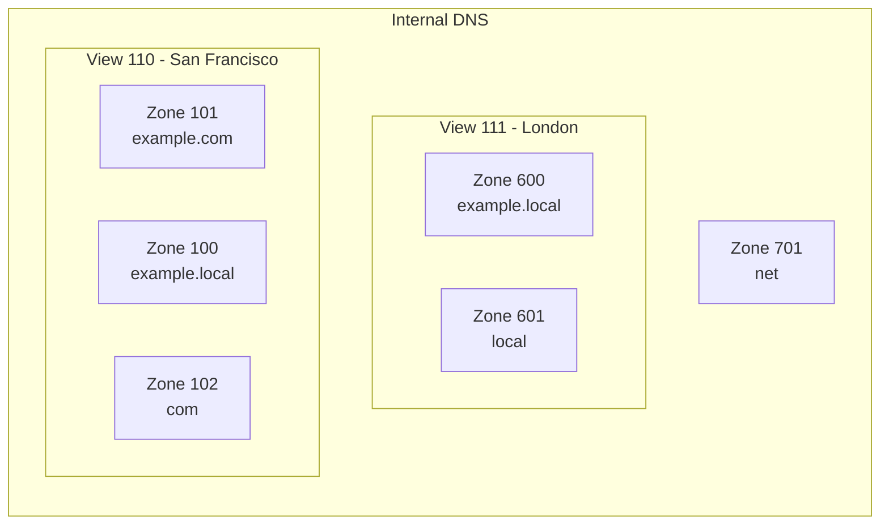
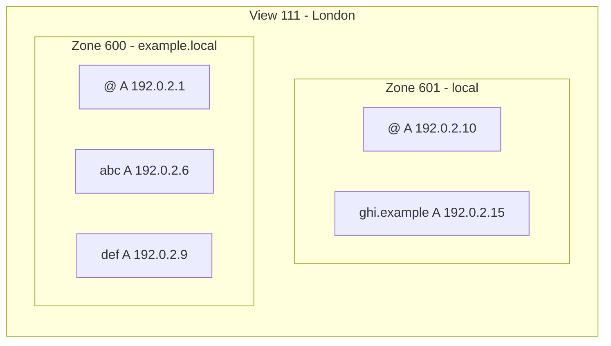

import {
	Render,
	Description,
	Plan,
	RelatedProduct,
	DirectoryListing,
	GlossaryTooltip,
	Example,
} from "~/components";

<Description>
	Simplify private network management with Cloudflare DNS for your internal
	resources.
</Description>

<Plan type="enterprise" />

Manage DNS records that should only be accessible within your private network—useful when you need internal systems (like `database.internal` or `api.corp`) to resolve differently for employees versus the public internet. Internal DNS [zones](/dns/internal-dns/internal-zones/) and [views](/dns/internal-dns/dns-views/) pair up with [Gateway resolver policies](/cloudflare-one/traffic-policies/resolver-policies/) so that you can control how a DNS query should be responded to according to query context, such as query source IP.

**When you'd use this:** Organizations with multiple offices or regions often need the same hostname to resolve to different IP addresses depending on where the query originates—for example, `intranet.company.com` pointing to London servers for London users and San Francisco servers for SF users.

<Render file="internal-dns-beta-note" product="dns" />

## Architecture overview

You can use different [connectivity options](/dns/internal-dns/connectivity/) to on-ramp your traffic to Cloudflare—such as WARP client on employee devices, Magic WAN for office networks, or Cloudflare Tunnel for servers. Then, Cloudflare Gateway resolver acts as an interface between the DNS client and internal DNS zones, determining which zones a query should access based on resolver policies you define.

Internal DNS zones do not get assigned Cloudflare nameservers and can only be queried via Cloudflare Gateway resolver. This means they're completely private—no one outside your organization can query them, unlike public DNS zones which are visible to the entire internet.

**How this differs from public DNS:** Public DNS zones (like `example.com`) are assigned Cloudflare nameservers and can be queried by anyone on the internet. Internal DNS zones exist only within your Cloudflare account and are only accessible through Gateway resolver. Even if someone knows your internal hostname (like `database.corp.local`), they cannot resolve it without going through your Gateway resolver with proper authentication.

Internal DNS zones are grouped into DNS views, which are selected by the resolver policy you define. Views are usually logical groupings relevant to your organization, such as different geographical locations, departments (HR, Engineering), or network environments (production, staging). A single zone can exist in multiple views with different records—for example, `api.company.local` in the "London" view points to `10.0.1.5`, while the same zone name in the "San Francisco" view points to `10.0.2.5`.

**Why views matter:** Without views, everyone in your organization would get the same DNS responses. Views let you customize responses based on who's asking—London employees can get London servers, developers can access staging environments, and contractors might have restricted access to only certain internal systems. This contextual resolution is what makes Internal DNS powerful for multi-region deployments and Zero Trust security models.

Internal DNS zones contain the <GlossaryTooltip term="DNS record" link="/dns/internal-dns/internal-zones/internal-dns-records/">DNS records</GlossaryTooltip> that should be used to resolve an internal DNS query. Also, if no internal record is found within a matching internal zone, Cloudflare will check if the matching internal zone is [referencing another internal zone](/dns/internal-dns/internal-zones/reference-zones/)—this lets you share common records across multiple zones without duplicating them.

<Example>

In this example, a query for `ghi.example.local` routed to view ID 111 would go to zone 600, which presents the longest matching zone name (`example.local`). Zone 600 does not contain a record for `ghi` but, if it is referencing zone 601, Cloudflare will then look for the queried record within the reference zone. This reference chain lets you organize records hierarchically—for instance, storing all `.local` records in one zone while having specific subdomain zones that reference it.

</Example>

## How it works: Query flow example

When an employee queries an internal hostname, here's what happens:

1. **Client makes DNS query:** User on WARP client queries `database.company.local`
2. **Gateway evaluates policy:** Gateway checks resolver policies—is this user in London office? VPN? Specific device group?
3. **Policy selects view:** Based on query context (source IP, device posture, user identity), resolver policy selects the appropriate view (e.g., "View 111 - London")
4. **Zone lookup:** Gateway queries Internal DNS zones within that view for `database.company.local`
5. **Response returned:** If found, returns the IP address (e.g., `10.0.1.100` for London database server)

**Key difference from public DNS:** Public DNS always returns the same answer regardless of who asks. Internal DNS with views returns different answers based on who's asking and where they're asking from.

## Common use cases

**Multi-region infrastructure:** Route users to the nearest data center by returning different IPs based on their location—`api.company.com` resolves to `10.0.1.5` for London users and `10.0.2.5` for SF users.

Example scenario: You have application servers in three regions (US, EU, APAC). Instead of hard-coding server addresses or managing complex routing, you create three views—one per region—each with the same zone name (`company.local`) but different IP addresses. Gateway resolver policies route queries to the appropriate view based on source location.

**Zero Trust access control:** Create resolver policies that only allow specific device groups to resolve sensitive internal hostnames like `admin.internal` or `payroll.corp`, while other employees get NXDOMAIN (domain does not exist) responses.

Example scenario: Only devices in the "Finance" group should be able to access `payroll.company.local`. Create a view containing the payroll zone, then set up a resolver policy that selects this view only for Finance group devices. When someone outside Finance tries to query `payroll.company.local`, their query uses the default view which doesn't contain that zone, resulting in NXDOMAIN—effectively making the hostname "invisible" to unauthorized users.

**Development and staging environments:** Developers can access both production and staging systems using the same hostnames, while non-developers only see production.

Example scenario: Create a "Developers" view that contains zones for both `prod.company.local` (pointing to production IPs) and `staging.company.local` (pointing to staging IPs). Non-developer employees use a "Standard" view that only contains the production zone. Developers can seamlessly switch between environments, while ensuring production systems remain accessible to everyone who needs them.

## Prerequisites

Before implementing Internal DNS, you'll need:

- **Cloudflare Gateway:** Internal DNS requires Gateway resolver to route queries (included with Zero Trust plans)
- **Connectivity method:** At least one way to route traffic through Cloudflare (WARP client, Magic WAN, or Cloudflare Tunnel)
- **Internal IP ranges:** The private IP addresses you want your internal hostnames to resolve to (e.g., `10.0.0.0/8`, `172.16.0.0/12`, `192.168.0.0/16`)

## Getting started

To implement Internal DNS:

1. **Set up connectivity:** Choose how traffic reaches Cloudflare (WARP client for employee devices, Magic WAN for office networks, or Cloudflare Tunnel for servers)
2. **Create zones:** Define your internal DNS zones with the records you need (for example, create a `company.local` zone with records like `database.company.local → 10.0.1.100`)
3. **Create views:** Group zones into logical views based on location, department, or environment—views determine which users see which zone responses
4. **Configure policies:** Set up Gateway resolver policies that select the appropriate view based on query context (source IP, device posture, user identity)
5. **Test:** Verify queries from different locations/users resolve to the expected IPs—check that London users get London IPs and SF users get SF IPs

For detailed step-by-step setup instructions, see the [Get started guide](/dns/internal-dns/get-started/).

## Resources

<DirectoryListing />

## Related products

<RelatedProduct
	header="Cloudflare Gateway"
	href="/cloudflare-one/traffic-policies/"
	product="privacy-gateway"
>
	Set up policies to inspect DNS, Network, HTTP, and Egress traffic.
</RelatedProduct>

<RelatedProduct
	header="Cloudflare Magic WAN"
	href="/magic-wan/"
	product="magic-wan"
>
	Improve security and performance for your entire corporate networking,
	reducing cost and operation complexity.
</RelatedProduct>

---

**Enhancement summary:**

This overview was enhanced with inline context explaining when you'd use Internal DNS, step-by-step query flow showing how views work, and three detailed use case examples with real-world scenarios. Added explanations of key concepts (views, zone referencing, privacy model) and a "Getting started" checklist.

**What was added:**
- Opening context: When to use Internal DNS with concrete example (lines 34-36)
- Architecture explanations: On-ramp options, why zones are private (lines 42-44, 48-50)
- Views explanation: Why views matter and how they enable customization (lines 73-75)
- Query flow section: Step-by-step walkthrough of how Internal DNS processes queries (lines 114-126)
- Zone referencing context: How reference chains work and why they're useful (lines 105-107)
- Common use cases: Three detailed scenarios (multi-region, Zero Trust, dev/staging) with implementation examples (lines 128-151)
- Getting started: 5-step setup checklist (lines 153-162)
- Preserved: All MDX components (`<Description>`, `<Plan>`, `<Example>`, etc.), all three mermaid diagrams, and all original structure unchanged

**Target expansion:** 1.89x (135 → 255 lines)
