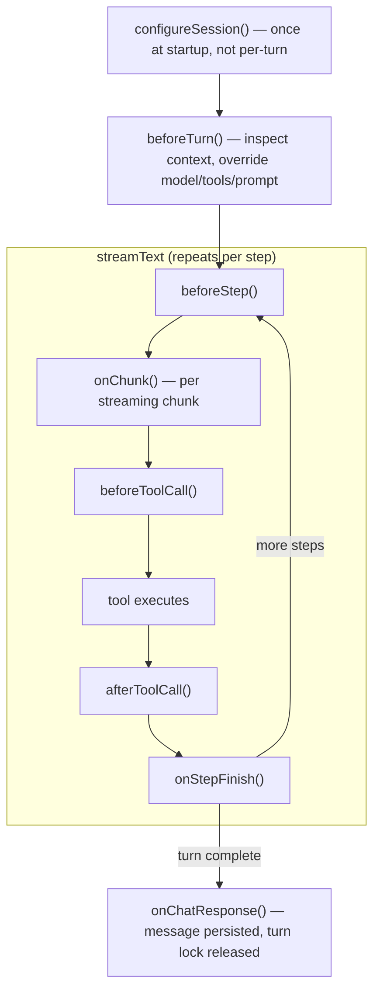

import { TypeScriptExample } from "~/components";

Think owns the `streamText` call and provides hooks at each stage of the chat turn. Hooks fire on every turn regardless of entry path — WebSocket chat, sub-agent `chat()`, `saveMessages()`, durable `submitMessages()` execution, `continueLastTurn()`, and auto-continuation after tool results.

## Hook summary

| Hook                             | When it fires                                               | Return                            | Async |
| -------------------------------- | ----------------------------------------------------------- | --------------------------------- | ----- |
| `configureSession(session)`      | Once during `onStart`                                       | `Session`                         | yes   |
| `beforeTurn(ctx)`                | Before `streamText`                                         | `TurnConfig` or void              | yes   |
| `beforeStep(ctx)`                | Before each model step                                      | `StepConfig` or void              | yes   |
| `beforeToolCall(ctx)`            | Before a server-side tool executes                          | `ToolCallDecision` or void        | yes   |
| `afterToolCall(ctx)`             | After a tool outcome is known                               | void                              | yes   |
| `onStepFinish(ctx)`              | After each step completes                                   | void                              | yes   |
| `onChunk(ctx)`                   | Per streaming chunk                                         | void                              | yes   |
| `onChatResponse(result)`         | After turn completes and message is persisted               | void                              | yes   |
| `onChatError(error, ctx?)`       | On error during a turn                                      | error to propagate                | no    |
| `classifyChatError(error, ctx?)` | On a turn error, when `contextOverflow.reactive` is enabled | `ChatErrorClassification` or void | no    |

## Execution order

For a turn with two tool calls:



## beforeTurn

Called before `streamText`. Receives the fully assembled context — system prompt, converted messages, merged tools, and model. Return a `TurnConfig` to override any part, or void to accept defaults.

```ts
beforeTurn(ctx: TurnContext): TurnConfig | void | Promise<TurnConfig | void>
```

### TurnContext

| Field          | Type                      | Description                                                                  |
| -------------- | ------------------------- | ---------------------------------------------------------------------------- |
| `system`       | `string`                  | Assembled system prompt (from context blocks or `getSystemPrompt()`)         |
| `messages`     | `ModelMessage[]`          | Assembled model messages (truncated, pruned)                                 |
| `tools`        | `ToolSet`                 | Merged tool set (workspace + getTools + session + extensions + MCP + client) |
| `model`        | `LanguageModel`           | The model from `getModel()`                                                  |
| `continuation` | `boolean`                 | Whether this is a continuation turn (auto-continue after tool result)        |
| `body`         | `Record<string, unknown>` | Custom body fields from the client request                                   |

### TurnConfig

All fields are optional. Return only what you want to change.

| Field                      | Type                                           | Description                                                                                                                                                                                               |
| -------------------------- | ---------------------------------------------- | --------------------------------------------------------------------------------------------------------------------------------------------------------------------------------------------------------- |
| `model`                    | `LanguageModel`                                | Override the model for this turn                                                                                                                                                                          |
| `system`                   | `string`                                       | Override the system prompt                                                                                                                                                                                |
| `messages`                 | `ModelMessage[]`                               | Override the assembled messages                                                                                                                                                                           |
| `tools`                    | `ToolSet`                                      | Extra tools to merge (additive)                                                                                                                                                                           |
| `activeTools`              | `string[]`                                     | Limit which tools the model can call                                                                                                                                                                      |
| `toolChoice`               | `ToolChoice`                                   | Force a specific tool call                                                                                                                                                                                |
| `maxSteps`                 | `number`                                       | Override `maxSteps` for this turn                                                                                                                                                                         |
| `sendReasoning`            | `boolean`                                      | Send reasoning chunks for this turn                                                                                                                                                                       |
| `chatStreamStallTimeoutMs` | `number`                                       | Override the stream-stall watchdog for this turn (`0` disables it); auto-resets after the turn. Useful for a turn with a known-slow tool — refer to [Durable recovery](/agents/harnesses/think/recovery/) |
| `output`                   | `Output`                                       | Request structured output for this turn                                                                                                                                                                   |
| `providerOptions`          | `Record<string, unknown>`                      | Provider-specific options                                                                                                                                                                                 |
| `experimental_telemetry`   | `object`                                       | AI SDK telemetry settings for this turn                                                                                                                                                                   |
| `experimental_transform`   | `StreamTextTransform \| StreamTextTransform[]` | AI SDK stream transform(s) for this turn — inspect or rewrite stream parts (for example, emit `source` parts derived from tool results). Applied in order.                                                |

### Examples

Switch to a cheaper model for continuation turns:

```ts
beforeTurn(ctx: TurnContext) {
	if (ctx.continuation) {
		return { model: this.cheapModel };
	}
}
```

Restrict which tools the model can call:

```ts
beforeTurn(ctx: TurnContext) {
	return { activeTools: ["read", "write", "getWeather"] };
}
```

Add per-turn context from the client body:

```ts
beforeTurn(ctx: TurnContext) {
	if (ctx.body?.selectedFile) {
		return {
			system: ctx.system + `\n\nUser is editing: ${ctx.body.selectedFile}`,
		};
	}
}
```

Hide reasoning for internal continuation turns:

```ts
beforeTurn(ctx: TurnContext) {
	if (ctx.continuation) {
		return { sendReasoning: false };
	}
}
```

Force structured output for a turn:

```ts
import { Output } from "ai";
import { z } from "zod";

const ResultSchema = z.object({ severity: z.enum(["low", "high"]) });

beforeTurn(ctx: TurnContext) {
	if (ctx.body?.mode === "structured-answer") {
		return {
			output: Output.object({ schema: ResultSchema }),
			activeTools: [],
		};
	}
}
```

`output` is a turn-level setting only. The AI SDK's `prepareStep` does not accept an `output` override, so `beforeStep` cannot toggle structured output on a single step.

## beforeStep

Called before each AI SDK step in the agentic loop. Think forwards this hook to `streamText` as `prepareStep`, so it receives the AI SDK's full prepare-step context and can return per-step overrides. Use `beforeTurn` for turn-wide assembly and `beforeStep` when the decision depends on the step number or previous step results.

```ts
beforeStep(ctx: PrepareStepContext): StepConfig | void {
	if (ctx.stepNumber > 0) {
		return { activeTools: [] };
	}
}
```

## beforeToolCall

Called before a server-side tool's `execute` function runs. Think wraps each server-side tool so the hook can allow, modify, block, or substitute the call before the model receives the tool result.

```ts
beforeToolCall(ctx: ToolCallContext): ToolCallDecision | void {
	if (ctx.toolName === "delete" && this.isReadOnlyMode) {
		return { action: "block", reason: "delete is disabled in read-only mode" };
	}

	if (ctx.toolName === "weather") {
		const cached = this.weatherCache.get(JSON.stringify(ctx.input));
		if (cached) return { action: "substitute", output: cached };
	}
}
```

| Field         | Type                       | Description                                |
| ------------- | -------------------------- | ------------------------------------------ |
| `toolName`    | `string`                   | Name of the tool being called              |
| `input`       | `unknown`                  | Input the model provided                   |
| `toolCallId`  | `string`                   | ID for this tool call                      |
| `messages`    | `ModelMessage[]`           | Messages visible at tool execution time    |
| `abortSignal` | `AbortSignal \| undefined` | Signal that aborts if the turn is canceled |

Return a `ToolCallDecision` to control execution:

| Decision                           | Behavior                                                      |
| ---------------------------------- | ------------------------------------------------------------- |
| `void` or `{ action: "allow" }`    | Run the original tool with the original input                 |
| `{ action: "allow", input }`       | Run the original tool with modified input                     |
| `{ action: "block", reason }`      | Skip the original tool and return `reason` as the tool result |
| `{ action: "substitute", output }` | Skip the original tool and return `output` as the tool result |

If a wrapped tool returns an `AsyncIterable` for preliminary tool results, Think collapses the iterable to its final yielded value after `beforeToolCall` runs. If you need true preliminary streaming from that tool, avoid intercepting it with `beforeToolCall`.

## afterToolCall

Called after a tool outcome is known. This includes real executions, blocked calls, substituted calls, and thrown tool errors.

```ts
afterToolCall(ctx: ToolCallResultContext) {
	if (!ctx.success) return;

	this.env.ANALYTICS.writeDataPoint({
		blobs: [ctx.toolName],
		doubles: [JSON.stringify(ctx.output).length],
	});
}
```

| Field        | Type             | Description                                          |
| ------------ | ---------------- | ---------------------------------------------------- |
| `toolName`   | `string`         | Name of the tool that was called                     |
| `input`      | `unknown`        | Input the model provided                             |
| `toolCallId` | `string`         | ID for this tool call                                |
| `messages`   | `ModelMessage[]` | Messages visible at tool execution time              |
| `durationMs` | `number`         | Tool execution duration in milliseconds              |
| `success`    | `boolean`        | Whether the model received a successful tool outcome |
| `output`     | `unknown`        | Present when `success` is `true`                     |
| `error`      | `unknown`        | Present when `success` is `false`                    |

For blocked and substituted tool calls, `success` is `true` because the model receives a valid tool result. Only thrown errors from the original tool execution surface as `success: false`.

## onStepFinish

Called after each step completes in the agentic loop. `StepContext` is the AI SDK's step-finish event, so it includes the full step record: generated text, reasoning, files, sources, typed tool calls and results, usage, warnings, request and response metadata, and provider metadata.

```ts
onStepFinish(ctx: StepContext) {
	console.log(
		`Step ${ctx.stepNumber} (${ctx.finishReason}): ` +
			`${ctx.usage.inputTokens}in/${ctx.usage.outputTokens}out`,
	);
}
```

| Field              | Description                                       |
| ------------------ | ------------------------------------------------- |
| `stepNumber`       | Zero-based index of the step                      |
| `text`             | Text generated in this step                       |
| `reasoning`        | Reasoning parts emitted by the model              |
| `files`            | Files generated during the step                   |
| `sources`          | Citations or sources used by the model            |
| `toolCalls`        | Typed tool calls made in this step                |
| `toolResults`      | Typed tool results received in this step          |
| `finishReason`     | Why the step ended                                |
| `usage`            | Token usage, including cache and reasoning tokens |
| `providerMetadata` | Provider-specific metadata                        |

## onChunk

Called for each streaming chunk. High-frequency — fires per token. Use for streaming analytics, progress indicators, or token counting. Observational only.

## onChatResponse

Called after a chat turn produces and persists an assistant message. The turn lock is released before this hook runs, so it is safe to call `saveMessages` or other methods from inside.

Fires for all turn paths that persist an assistant message: WebSocket, sub-agent RPC, `saveMessages`, and auto-continuation. If a turn fails before producing any assistant parts, `onChatError` handles the error instead.

```ts
onChatResponse(result: ChatResponseResult) {
	if (result.status === "completed") {
		console.log(`Turn ${result.requestId}: ${result.message.parts.length} parts`);
	}
}
```

| Field          | Type                                  | Description                                |
| -------------- | ------------------------------------- | ------------------------------------------ |
| `message`      | `UIMessage`                           | The persisted assistant message            |
| `requestId`    | `string`                              | Unique ID for this turn                    |
| `continuation` | `boolean`                             | Whether this was a continuation turn       |
| `status`       | `"completed" \| "error" \| "aborted"` | How the turn ended                         |
| `error`        | `string?`                             | Error message (when `status` is `"error"`) |

## onChatError

Called when an error occurs during a chat turn. Return the error to propagate it, or return a different error. The optional context describes where the failure happened and whether user messages were already persisted. The partial assistant message (if any) is persisted before this hook fires.

```ts
onChatError(error: unknown, ctx?: ChatErrorContext): unknown
```

`ChatErrorContext` includes:

| Field               | Type                                                                       | Description                                                                                                                                                                          |
| ------------------- | -------------------------------------------------------------------------- | ------------------------------------------------------------------------------------------------------------------------------------------------------------------------------------ |
| `requestId`         | `string \| undefined`                                                      | Chat request ID, when available                                                                                                                                                      |
| `stage`             | `"parse" \| "persist" \| "turn" \| "stream" \| "recovery" \| "transcript"` | Failure stage                                                                                                                                                                        |
| `messagesPersisted` | `boolean`                                                                  | Whether incoming user messages were already stored                                                                                                                                   |
| `classification`    | `ChatErrorClassification \| undefined`                                     | Set to `"context_overflow"` on the terminal `onChatError` when a context overflow could not be recovered (refer to [`classifyChatError`](#classifychaterror)); `undefined` otherwise |

Think also emits `chat:request:failed` on the `agents:chat` observability channel with the same stage and persistence information.

```ts
onChatError(error: unknown, ctx?: ChatErrorContext) {
	console.error("Chat turn failed:", ctx?.stage, error);
	if (ctx?.classification === "context_overflow") {
		return new Error("This conversation is too long to continue. Please start a new one.");
	}
	return new Error("Something went wrong. Please try again.");
}
```

## classifyChatError

Called when an error occurs during a turn, **before** `onChatError`. Maps a raw provider error into a provider-agnostic category so Think can react without baking provider-specific strings into the framework — the same split as the `tokenCounter` you pass to `compactAfter()`. The app owns the mapping because it knows which provider and model it talks to.

```ts
classifyChatError(error: unknown, ctx?: ChatErrorContext): ChatErrorClassification | void
```

`ChatErrorClassification` is `"context_overflow" | "rate_limit" | "transient" | "fatal" | "unknown"`. Today this hook drives only context-overflow recovery. Think calls it when a turn errors and `contextOverflow.reactive` is enabled. If reactive is off, it is not called.

Returning `"context_overflow"` runs the compact-and-retry backstop (refer to [Context-window overflow recovery](/agents/harnesses/think/recovery/#context-window-overflow-recovery)). If recovery cannot save the turn, that classification is surfaced on the terminal `onChatError` call through `ChatErrorContext.classification`.

The other categories are reserved for future use. Returning one today is a no-op and is not forwarded to `onChatError`. Returning `void` (the default) keeps the existing terminal behavior.

The argument may be an `Error`, an AI SDK `APICallError` (with `statusCode`/`responseBody`), or — for in-stream provider errors that surface as a stream error part rather than a throw — the error message string. Narrow accordingly. Provider context-overflow errors arrive as in-stream error parts, so this hook receives them in string form, not as a thrown exception.

The second argument is a [`ChatErrorContext`](#onchaterror). During overflow recovery it is `{ stage: "stream", requestId }`, so a classifier can correlate the error with the in-flight turn — for example, to call `cancelChat(requestId)` and bail out of recovery.

### Example

For the common case, assign the bundled `defaultContextOverflowClassifier`, which matches the context-overflow errors of Anthropic, OpenAI, Google, Bedrock, and others:

<TypeScriptExample>

```ts
import { Think, defaultContextOverflowClassifier } from "@cloudflare/think";

export class MyAgent extends Think<Env> {
	override classifyChatError = defaultContextOverflowClassifier;
}
```

</TypeScriptExample>

Or write your own, optionally delegating to the bundled classifier:

<TypeScriptExample>

```ts
import type { ChatErrorClassification } from "@cloudflare/think";
import { Think, defaultContextOverflowClassifier } from "@cloudflare/think";

export class MyAgent extends Think<Env> {
	override classifyChatError(error: unknown): ChatErrorClassification | void {
		if (error instanceof Error && /rate.?limit/i.test(error.message)) {
			return "rate_limit";
		}
		return defaultContextOverflowClassifier(error);
	}
}
```

</TypeScriptExample>
