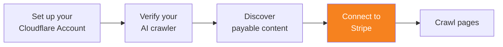

import { Steps, DashButton } from "~/components";

Connect your Cloudflare account to Stripe to process payments. Pay per crawl uses Stripe to process payments between AI crawler owners and site owners.

<Steps>
1. In the Cloudflare dashboard, go to **Manage Account** > **Settings**.

   <DashButton url="/?to=/:account/configurations" />

2. Go to the **Pay Per Crawl** tab.
3. From **Connect to Stripe**, select **Connect**.
4. Select **Continue to Stripe**.
5. Follow the on-screen instructions to connect your Cloudflare account to a Stripe account.
   :::note[Use a non-personal email address]
   Cloudflare recommends using a dedicated email to manage your pay per crawl account (for example, `aicrawler@company.com`).
   :::
</Steps>

When you successfully connect Stripe to your account, you will see a green tick ✅ next to **Stripe connection**.

:::caution[Spending limits]
Cloudflare is not responsible for configuring spending limits. Ensure you have configured a maximum spending limit on your AI crawler.
:::

## Billing

Charges are recorded upon successful delivery of content that is requested with valid [crawler price headers](/ai-crawl-control/features/pay-per-crawl/use-pay-per-crawl-as-ai-owner/crawl-pages/#21-include-payment-headers).

Invoices are created and managed via Stripe. Crawlers are responsible for setting and enforcing their own spending limits.
