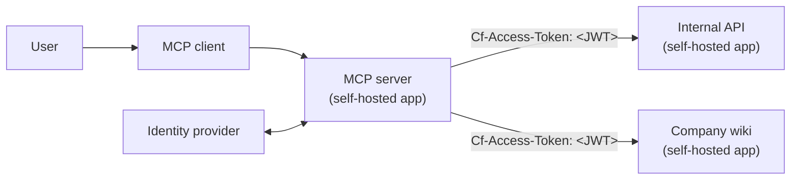
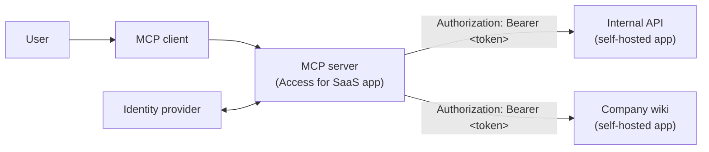

import { Render } from "~/components";

MCP servers often need to call internal applications on behalf of authenticated users. For example, an MCP server that helps employees interact with internal tools needs to forward the user's identity to those downstream services (the internal applications the MCP server connects to) so that each request is authorized with the correct permissions.

The [Linked App Token](/cloudflare-one/access-controls/applications/linked-app-token/) policy selector enables this by allowing an Access policy on one application to accept tokens issued for another. There are two ways to set this up depending on how your MCP server is deployed.

## Self-hosted MCP server (recommended)

If your MCP server is a [self-hosted Access application](/cloudflare-one/access-controls/applications/http-apps/self-hosted-public-app/), Cloudflare Access handles authentication automatically. The MCP server receives the user's JWT from Access in the `Cf-Access-Jwt-Assertion` header and should forward it to downstream applications in the `Cf-Access-Token` header. No OAuth implementation is needed in your MCP server code.



### Prerequisites

- Add your downstream applications (for example, your `Internal API` and `Company wiki`) as [self-hosted Access applications](/cloudflare-one/access-controls/applications/http-apps/self-hosted-public-app/).
- Add your MCP server as a [self-hosted Access application](/cloudflare-one/access-controls/applications/http-apps/self-hosted-public-app/).

### 1. Configure downstream applications

On each self-hosted application that the MCP server needs to access (for example, the `Internal API` and `Company wiki` apps), create a Linked App Token policy:

<Render
	file="access/create-linked-app-token-policy"
	product="cloudflare-one"
	params={{
		sourceAppLabel: "the MCP server application",
		downstreamAppLabel: "the downstream application",
		exampleValue: "mcp-server-app",
		policyName: "Allow requests from MCP server",
		exampleName: "mcp-server-app",
		appType: "self_hosted",
	}}
/>

### 2. Configure your MCP server

In your MCP server code, forward the `Cf-Access-Jwt-Assertion` header from incoming requests as the `Cf-Access-Token` header on outgoing requests to the downstream application:

```txt
Cf-Access-Token: <JWT from Cf-Access-Jwt-Assertion>
```

Access will now validate the JWT token against the Linked App Token rule and propagate the user's identity to the downstream application.

## SaaS MCP server (Access for SaaS with OAuth)

If your MCP server is registered as an [Access for SaaS OIDC application](/cloudflare-one/access-controls/ai-controls/secure-mcp-servers/) and implements [MCP OAuth](https://modelcontextprotocol.io/specification/2025-03-26/basic/authorization), it receives an OAuth `access_token` from Cloudflare Access. The MCP server forwards this token to downstream self-hosted applications in the `Authorization: Bearer` header.

This approach requires your MCP server to implement the OAuth authorization code flow. Use the [self-hosted MCP server approach](#self-hosted-mcp-server-recommended) if you want Cloudflare to handle authentication for you.



### Prerequisites

- Add your downstream applications (for example, your `Internal API` and `Company wiki`) as [self-hosted Access applications](/cloudflare-one/access-controls/applications/http-apps/self-hosted-public-app/).
- Add your MCP server as an [Access for SaaS OIDC application](/cloudflare-one/access-controls/ai-controls/secure-mcp-servers/#access-for-saas-application).

### 1. Configure downstream applications

On each self-hosted application that the MCP server needs to access (for example, the `Internal API` and `Company wiki` apps), create a Linked App Token policy:

<Render
	file="access/create-linked-app-token-policy"
	product="cloudflare-one"
	params={{
		sourceAppLabel: "the MCP server application",
		downstreamAppLabel: "the downstream application",
		exampleValue: "mcp-server-app",
		policyName: "Allow requests from MCP server",
		exampleName: "mcp-server-app",
		appType: "saas",
	}}
/>

### 2. Configure your MCP server

Configure the MCP server to forward the `access_token` in outgoing requests:

```txt
Authorization: Bearer ACCESS_TOKEN
```

## Known limitations

<Render
	file="access/linked-app-token-known-limitations"
	product="cloudflare-one"
/>
