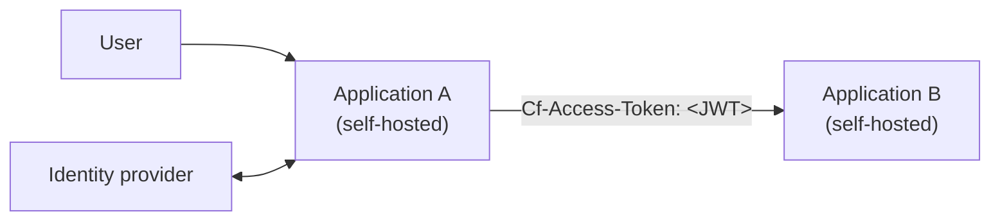
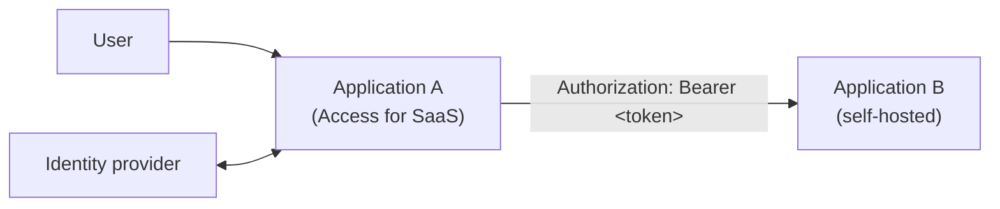

import { Render } from "~/components";

The **Linked App Token** policy selector allows an Access policy on one application to accept tokens issued for another application. This is useful when one application needs to make authenticated requests to another on behalf of a user — for example, an MCP server calling internal APIs, or a microservice forwarding user identity to a downstream service.

Linked App Token supports two flows:

- [**Self-hosted to self-hosted**](#self-hosted-to-self-hosted) — A self-hosted application forwards its Access JWT to another self-hosted application. This is the simplest setup and requires no additional OAuth configuration.
- [**SaaS to self-hosted**](#saas-to-self-hosted) — An Access for SaaS application (such as an [MCP server using OAuth](/cloudflare-one/access-controls/ai-controls/secure-mcp-servers/#access-for-saas-application)) sends its OAuth access token to a self-hosted application.

## Self-hosted to self-hosted

In this flow, Application A is a [self-hosted Access application](/cloudflare-one/access-controls/applications/http-apps/self-hosted-public-app/) that needs to make requests to Application B, another self-hosted Access application. When a user authenticates to Application A, Cloudflare Access sends the user's JWT to Application A in the `Cf-Access-Jwt-Assertion` header. Application A can then forward that token to Application B in the `Cf-Access-Token` header. Access will validate the token against the Linked App Token rule on Application B's policy and allow the request if the token was issued for Application A.



### Prerequisites

- Two [self-hosted Access applications](/cloudflare-one/access-controls/applications/http-apps/self-hosted-public-app/)

### 1. Create a Linked App Token policy

Create a policy on Application B (the downstream application that will receive forwarded requests):

<Render
	file="access/create-linked-app-token-policy"
	product="cloudflare-one"
	params={{
		sourceAppLabel: "Application A",
		downstreamAppLabel: "Application B",
		exampleValue: "application-a",
		policyName: "Allow requests from Application A",
		exampleName: "application-a",
		appType: "self_hosted",
	}}
/>

### 2. Forward the Access JWT

When Cloudflare Access authenticates a user to Application A, it sends a signed JWT in the `Cf-Access-Jwt-Assertion` request header. Application A must forward this token to Application B in the `Cf-Access-Token` header:

```txt
Cf-Access-Token: <JWT from Cf-Access-Jwt-Assertion>
```

When Access receives the request to Application B, it will:

1. Extract the token from the `Cf-Access-Token` header.
2. Validate that the token was issued for Application A (matching the `app_uid` in the Linked App Token rule).
3. If valid, Access issues a new `Cf-Access-Jwt-Assertion` scoped to Application B's AUD tag, forwards it to Application B's origin, and attributes the request to the original user in the audit log.

## SaaS to self-hosted

In this example an [Access for SaaS application](/cloudflare-one/access-controls/applications/http-apps/saas-apps/) (for example, an MCP server that implements [OAuth](https://modelcontextprotocol.io/specification/2025-03-26/basic/authorization)) needs to make requests to a self-hosted Access application. The SaaS app obtains an OAuth access token from Cloudflare Access and sends it to the self-hosted application in the `Authorization: Bearer` header.



### Prerequisites

- A [self-hosted Access application](/cloudflare-one/access-controls/applications/http-apps/self-hosted-public-app/)
- An [Access for SaaS OIDC application](/cloudflare-one/access-controls/applications/http-apps/saas-apps/)

### 1. Create a Linked App Token policy

Create a policy on the self-hosted application (Application B):

<Render
	file="access/create-linked-app-token-policy"
	product="cloudflare-one"
	params={{
		sourceAppLabel: "the Access for SaaS app (Application A)",
		downstreamAppLabel: "the self-hosted app (Application B)",
		exampleValue: "application-a",
		policyName: "Allow requests from SaaS app",
		exampleName: "my-saas-app",
		appType: "saas",
	}}
/>

### 2. Configure token forwarding

The SaaS application must forward the OAuth `access_token` to the self-hosted application in an HTTP header:

```txt
Authorization: Bearer ACCESS_TOKEN
```

The end-to-end flow is:

1. The user authenticates against the Access for SaaS app via OAuth.
2. Upon success, the application receives an `access_token`.
3. The application makes a request to the self-hosted application with the token in the `Authorization: Bearer` header.
4. Cloudflare Access inspects the token and validates it against the `linked_app_token` rule. If valid, the request is allowed.

## Known limitations

<Render
	file="access/linked-app-token-known-limitations"
	product="cloudflare-one"
/>
