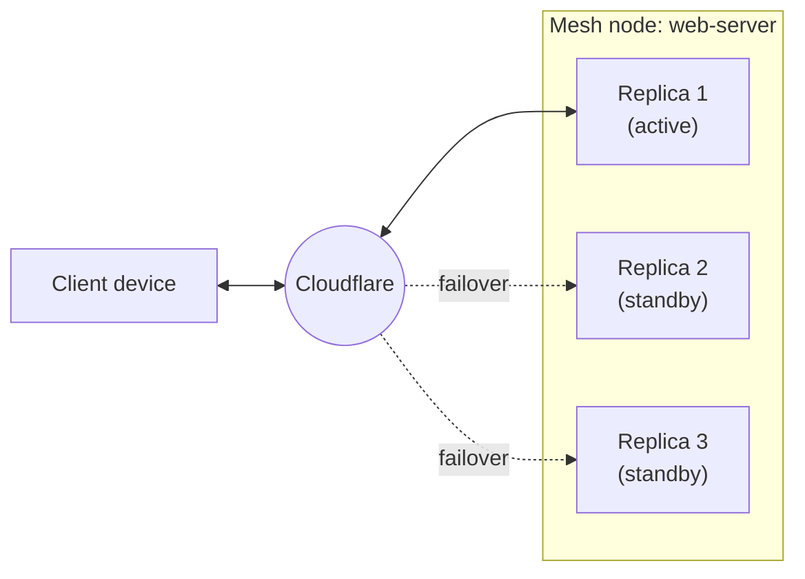

import { DashButton, Tabs, TabItem, Render, Details } from "~/components";

For production deployments, you can run multiple replicas of a Mesh node in active-passive mode. All replicas share the same node identity and advertise the same [routes](/cloudflare-one/networks/connectors/cloudflare-mesh/routes/). If the active replica goes down, Cloudflare automatically promotes a standby replica.

## When to use high availability

High availability provides resilience for CIDR route prefixes advertised by a Mesh node. When the active replica disconnects, Cloudflare promotes a standby so that traffic to the advertised subnets continues to flow.

This means HA is useful for nodes that have routes configured — nodes acting as subnet gateways for private networks behind them. If a node is only used for direct Mesh IP connectivity (no routes), HA has limited benefit because the node's Mesh IP is tied to the individual replica.

## How it works

When you create a Mesh node with high availability enabled, Cloudflare generates a single token for that node. You install the Cloudflare One Client on multiple Linux hosts using this token. Each host registers as a replica of the same node.

- All replicas advertise the same CIDR routes.
- One replica is active at a time. The others are passive standby.
- If the active replica disconnects, Cloudflare automatically promotes a passive replica.
- Failover is handled by Cloudflare's network.



## Create a node with high availability

<Tabs syncKey="dashPlusAPI"> <TabItem label="Dashboard">

When you create a Mesh node through the dashboard, high availability is enabled by default. To create a new node:

1. In the Cloudflare dashboard, go to **Networking** > **Mesh**.

   <DashButton url="/?to=/:account/mesh" />
2. Select **Add a node**.
3. Follow the setup wizard. The node is created with HA enabled automatically.
4. Copy the install commands and run them on your Linux host.

</TabItem> <TabItem label="API">

To create a node with high availability via the API, set `ha: true` in the request body:

```sh
curl -X POST "https://api.cloudflare.com/client/v4/accounts/{account_id}/warp_connector" \
  -H "Authorization: Bearer {api_token}" \
  -H "Content-Type: application/json" \
  -d '{
    "name": "web-server",
    "ha": true
  }'
```

The response includes a `token` field. Use this token to register replicas.

</TabItem> </Tabs>

## Add replicas

To add a replica to an existing high-availability node, install the Cloudflare One Client on a new Linux host and register it using the same node token.

<Tabs syncKey="dashPlusAPI"> <TabItem label="Dashboard">

1. In the Cloudflare dashboard, go to **Networking** > **Mesh**.

   <DashButton url="/?to=/:account/mesh" />

2. Select your Mesh node.
3. Select **Add a replica**.
4. A dialog shows the install commands and the node's token.
5. On a new Linux host, run the install commands shown in the dialog.

  <Details header="Installation commands">

	<Render file="mesh/install-node" product="cloudflare-one" />

  </Details>
</TabItem> <TabItem label="API">

1. Retrieve the node's token:

	```sh
	curl "https://api.cloudflare.com/client/v4/accounts/{account_id}/warp_connector/{node_id}/token" \
		-H "Authorization: Bearer {api_token}"
	```

	The response contains the token string.

2. Install the client and register on a new Linux host:

	<Render file="mesh/install-node" product="cloudflare-one" />

</TabItem> </Tabs>

The new replica will be in standby mode until the active replica disconnects.

## View replicas

<Tabs syncKey="dashPlusAPI"> <TabItem label="Dashboard">

1. In the Cloudflare dashboard, go to **Networking** > **Mesh**.

   <DashButton url="/?to=/:account/mesh" />

2. Select an HA-enabled node. HA nodes display an **HA** badge in the overview table.
3. The node detail page shows a tab for each replica. Each tab displays:
   - **Active** or **Passive** badge
   - Mesh IP (IPv4 and IPv6)
   - Edge data center
   - Origin IP
   - Platform, version, and device name
   - Connected since timestamp

</TabItem> <TabItem label="API">

To view all replicas and their HA status, query the connections API endpoint:

```sh
curl "https://api.cloudflare.com/client/v4/accounts/{account_id}/warp_connector/{node_id}/connections" \
  -H "Authorization: Bearer {api_token}"
```

The response includes each replica with its `ha_status` (`active` or `passive`), connection details, and the Cloudflare data center it is connected to:

```json
{
	"success": true,
	"result": [
		{
			"id": "bf69f118-238e-11f1-b113-ee02f3be4a5b",
			"conns": [
				{
					"colo_name": "lhr16",
					"origin_ip": "34.105.147.200",
					"opened_at": "2026-03-19T12:25:47.400Z"
				}
			],
			"run_at": "2026-03-19T12:25:47.400Z",
			"ha_status": "active"
		},
		{
			"id": "e07272a6-21fc-11f1-8997-e28f01ba3991",
			"conns": [
				{
					"colo_name": "lhr14",
					"origin_ip": "35.246.81.139",
					"opened_at": "2026-03-19T02:38:37.203Z"
				}
			],
			"run_at": "2026-03-19T02:38:37.203Z",
			"ha_status": "passive"
		}
	]
}
```

</TabItem> </Tabs>

## Manual failover

In addition to automatic failover when the active replica disconnects, you can manually promote a passive replica to active.

<Tabs syncKey="dashPlusAPI"> <TabItem label="Dashboard">

1. In the Cloudflare dashboard, go to **Networking** > **Mesh**.

   <DashButton url="/?to=/:account/mesh" />

2. Select an HA-enabled node.
3. Select the tab for the passive replica you want to promote.
4. Select **Promote to active**.
5. In the confirmation dialog, select **Promote to active** to confirm.

Traffic reroutes to the promoted replica immediately. The previous active replica switches to passive standby.

</TabItem> <TabItem label="API">

To manually trigger failover, send a `PUT` request with the `client_id` of the replica you want to promote:

```sh
curl -X PUT "https://api.cloudflare.com/client/v4/accounts/{account_id}/warp_connector/{node_id}/failover" \
  -H "Authorization: Bearer {api_token}" \
  -H "Content-Type: application/json" \
  -d '{
    "client_id": "e07272a6-21fc-11f1-8997-e28f01ba3991"
  }'
```

Get the `client_id` from the [connections endpoint](#view-replicas). Use the `id` field of the replica you want to promote.

</TabItem> </Tabs>

## Considerations

### Setup requirements

- High availability is set at node creation time and cannot be changed afterward.
- You must install the client on at least two hosts for failover to work. A single replica means no redundancy.
- High availability requires the MASQUE transport protocol. WireGuard does not support HA. Mesh nodes use MASQUE by default.

### Network configuration

- All replicas must be on the same subnet and have the same network routing configuration (Split Tunnels, static routes).
- HA provides resilience for CIDR route prefixes. Nodes without routes do not benefit from HA failover.

### Failover behavior

- Failover time depends on how quickly Cloudflare detects the active replica has disconnected (typically seconds).
- Inbound traffic (from Mesh clients to the subnet) fails over automatically on Cloudflare's network. Cloudflare routes traffic to the newly promoted active replica.
- Outbound traffic (from devices on the subnet through the Mesh node) does not fail over automatically. Your environment must detect that a different replica has been promoted to active and update routing tables to send traffic through the now-active host. There is no client-side failover for on-ramp traffic at this time.
