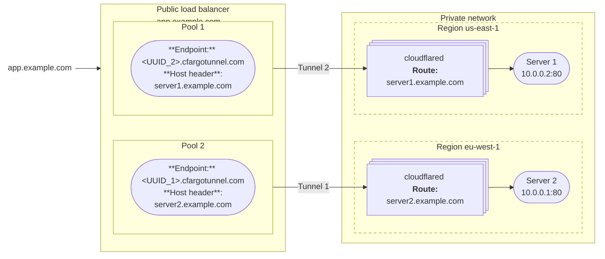
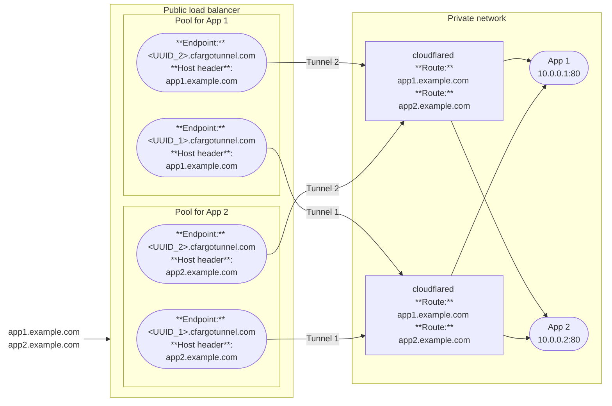

import { Render, DashButton, Details } from "~/components";

A [public load balancer](/load-balancing/load-balancers/) allows you to distribute traffic across the servers that are running your [published applications](/cloudflare-one/networks/connectors/cloudflare-tunnel/routing-to-tunnel/).

When you add a [published application route](/cloudflare-one/networks/connectors/cloudflare-tunnel/get-started/create-remote-tunnel/#2a-publish-an-application) to your Cloudflare Tunnel, Cloudflare generates a subdomain of `cfargotunnel.com` with the UUID of the created tunnel. You can add the application to a load balancer pool by using `<UUID>.cfargotunnel.com` as the [endpoint address](/load-balancing/understand-basics/load-balancing-components/#endpoints) and specifying the application hostname (`app.example.com`) in the [endpoint host header](/load-balancing/additional-options/override-http-host-headers/). Load Balancer does not support directly adding `app.example.com` as an endpoint if the service is behind Cloudflare Tunnel.

## Create a public load balancer

### Prerequisites

- A Cloudflare Tunnel with a [published application route](/cloudflare-one/networks/connectors/cloudflare-tunnel/get-started/create-remote-tunnel/#2a-publish-an-application)

### Create a load balancer

<Render
  file="tunnel/availability/load-balancer-create"
  product="cloudflare-one"
  params={{
    publishedAppRouteURL: "/cloudflare-one/networks/connectors/cloudflare-tunnel/get-started/create-remote-tunnel/#2a-publish-an-application",
    tunnelIdLocation: "the [Cloudflare dashboard](https://dash.cloudflare.com/) under **Networking** > **Tunnels**"
  }}
/>

Refer to the [Load Balancing documentation](/load-balancing/) for more details on load balancer settings and configurations.

### Optional Cloudflare settings

The application will default to the Cloudflare settings for the load balancer hostname, including [Rules](/rules/), [Cache Rules](/cache/how-to/cache-rules/) and [WAF rules](/waf/). You can change the settings for your hostname in the [Cloudflare dashboard](https://dash.cloudflare.com/).

## Common architectures

Review common load balancing configurations for published applications behind Cloudflare Tunnel.

### One app per load balancer

For this example, assume we have a web application that runs on servers in two different data centers. We want to connect the application to Cloudflare so that users can access the application from anywhere in the world. Additionally, we want Cloudflare to load balance between the servers such that if the primary server fails, the secondary server receives all traffic.

As shown in the diagram, a typical setup includes:
- A dedicated Cloudflare Tunnel per data center.
- One load balancer pool per tunnel. The load balancer hostname is set to the user-facing application hostname (`app.example.com`).
- One load balancer endpoint per pool. The endpoint host header is set to the `cloudflared` published application hostname (`server1.example.com`)
- At least two `cloudflared` [replicas](#session-affinity-and-replicas) per tunnel in their respective data centers, in case a `cloudflared` host machine goes down.

Users can now connect to the application using the load balancer hostname (`app.example.com`). Note that this configuration is only valid for [Active-Passive failover](/load-balancing/load-balancers/common-configurations/#active---passive-failover), since each pool only supports one endpoint per tunnel.

### Multiple apps per load balancer

The following diagram illustrates how to steer traffic to two different applications on a private network using a single load balancer.

This load balancing setup includes:

- Two Cloudflare Tunnels with identical routes to both applications.
- One load balancer pool per application.
- Each load balancer pool has an endpoint per tunnel.
- A [DNS record](#dns-records) for each application that points to the load balancer hostname.

Users can now access all applications through the load balancer. Since there are multiple tunnel endpoints per pool, this configuration supports [Active-Active Failover](/load-balancing/load-balancers/common-configurations/#active---active-failover). Active-Active uses all available endpoints in the pool to process requests simultaneously, providing better performance and scalability by load balancing traffic across them.

#### DNS records

When you configure a published application route via the dashboard, Cloudflare will automatically generate a `CNAME` DNS record that points the application hostname (`app1.example.com`) to the tunnel subdomain (`<UUID>.cfargotunnel.com`). You can [edit these DNS records](/dns/manage-dns-records/how-to/create-dns-records/#edit-dns-records) so that they point to the load balancer hostname instead.

:::note
Tunnel routes configured via the API or CLI require [manually creating DNS records](/cloudflare-one/networks/connectors/cloudflare-tunnel/routing-to-tunnel/dns/).
:::

Here is an example of what your DNS records will look like before and after setting up [Multiple apps per load balancer](#multiple-apps-per-load-balancer):

**Before**:
| Type | Name | Content |
| ---- | ---- | ------- |
| CNAME | app1 | `<UUID_1>.cfargotunnel.com` |
| CNAME | app2 | `<UUID_1>.cfargotunnel.com` |
| CNAME | app1 | `<UUID_2>.cfargotunnel.com` |
| CNAME | app2 | `<UUID_2>.cfargotunnel.com`  |

**After**:
| Type | Name | Content |
| ---- | ---- | ------- |
| LB   | `lb.example.com` | n/a |
| CNAME | app1 | `lb.example.com` |
| CNAME | app2 | `lb.example.com` |

## Known limitations

### Monitors and TCP tunnel origins

<Render
  file="tunnel/availability/load-balancer-tcp-monitors"
  product="cloudflare-one"
  params={{
    publishedAppRouteURL: "/cloudflare-one/networks/connectors/cloudflare-tunnel/get-started/create-remote-tunnel/#2a-publish-an-application"
  }}
/>

### Session affinity and replicas

The load balancer does not distinguish between [replicas](/cloudflare-one/networks/connectors/cloudflare-tunnel/configure-tunnels/tunnel-availability/) of the same tunnel. If you run the same tunnel UUID on two separate hosts, the load balancer treats both hosts as a single endpoint. To maintain [session affinity](/load-balancing/understand-basics/session-affinity/) between a client and a particular host, you will need to connect each host to Cloudflare using a different tunnel UUID.

### Local connection preference

<Render
  file="tunnel/availability/load-balancer-local-connection"
  product="cloudflare-one"
  params={{
    replicasURL: "/cloudflare-one/networks/connectors/cloudflare-tunnel/configure-tunnels/tunnel-availability/"
  }}
/>
