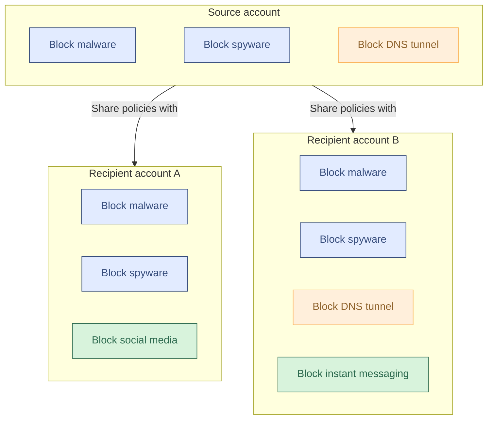

:::note
Only available on Enterprise plans.
:::

Gateway supports using [Cloudflare Organizations](/fundamentals/organizations/) to share configurations between and apply specific policies to accounts within an Organization. Tiered Gateway policies with Organizations support [DNS](/cloudflare-one/traffic-policies/dns-policies/), [network](/cloudflare-one/traffic-policies/network-policies/), [HTTP](/cloudflare-one/traffic-policies/http-policies/), and [resolver](/cloudflare-one/traffic-policies/resolver-policies/) policies.

For a DNS-only deployment using the Tenant API, refer to [Tenant API](/cloudflare-one/traffic-policies/tiered-policies/tenant-api/).

## Get started

To set up Cloudflare Organizations, refer to [Create an Organization](/fundamentals/organizations/#create-an-organization). Once you have provisioned and configured your Organization's accounts, you can create [Gateway policies](/cloudflare-one/traffic-policies/).

## Account types

Zero Trust accounts in Cloudflare Organizations include source accounts and recipient accounts.

In a tiered policy configuration, a top-level source account can share Gateway policies with its recipient accounts. Recipient accounts can add policies as needed while still being managed by the source account. Organization owners can also configure a [custom block page](/cloudflare-one/reusable-components/custom-pages/gateway-block-page/) for recipient accounts independently from the source account. Gateway will automatically [generate a unique root CA](/cloudflare-one/team-and-resources/devices/user-side-certificates/#generate-a-cloudflare-root-certificate) for each recipient account in an Organization.

Each recipient account is subject to the default Zero Trust [account limits](/cloudflare-one/account-limits/).

Gateway evaluates source account policies before any recipient account policies. Shared policies always take priority in recipient accounts — recipient accounts cannot bypass, modify, or reorder shared policies, and cannot move any of their own policies above shared ones. If you update the relative priority of shared policies in the source account, the change will be reflected in recipient accounts within approximately two minutes.

All traffic and corresponding policies, logs, and configurations for a recipient account will be contained to that recipient account. Organization owners can view logs for recipient accounts on a per-account basis, and [Logpush jobs](/logs/logpush/) must be configured separately. When using DLP policies with [payload logging](/cloudflare-one/data-loss-prevention/dlp-policies/logging-options/#log-the-payload-of-matched-rules), each recipient account must configure its own [encryption public key](/cloudflare-one/data-loss-prevention/dlp-policies/logging-options/#set-a-dlp-payload-encryption-public-key).

In the diagram above:

- Blue policies (**Block malware** and **Block spyware**) are shared from the source account.
- Orange policies (**Block DNS tunnel**) are not shared.
- Green policies (**Block social media** and **Block instant messaging**) are created locally in recipient accounts.

## Limitations

Tiered policies with Organizations have the following limitations:

- [Egress policies](/cloudflare-one/traffic-policies/egress-policies/) cannot be shared between accounts.
- Source accounts cannot share policies that use [device posture](/cloudflare-one/reusable-components/posture-checks/) selectors, the [Detected protocol](/cloudflare-one/traffic-policies/network-policies/#detected-protocol) selector, or the [Quarantine](/cloudflare-one/traffic-policies/http-policies/#quarantine) action. Source and recipient accounts can still create and apply policies with these selectors and actions separately from the Organization share.
- Policies can only be shared within an Organization. Sharing to sub-organizations is not supported.

:::caution
If a shared policy contains identity-based selectors, ensure that both the source account and recipient accounts have matching identity provider (IdP) configurations. If there is a mismatch in IdPs between the source account and a recipient account, the shared policy will never apply to traffic in that recipient account.
:::

## Manage policies

You can create, configure, and share your tiered policies in the source account for your Cloudflare Organization.

### Share policy

To share a Gateway policy from a source account to a recipient account:

1. In the [Cloudflare dashboard](https://dash.cloudflare.com/), go to **Zero Trust** > **Traffic policies** > **Firewall policies**.
2. Choose the policy type you want to share. If you want to share a resolver policy, go to **Traffic policies** > **Resolver policies**.
3. Find the policy you want to share from the list. In the three-dot menu, select **Share**. Alternatively, to bulk share multiple policies, you can select each policy you want to share, then select **Actions** > **Share**.
4. In **Select account**, choose the accounts you want to share the policy with. To share the policy with all existing and future recipient accounts in your Organization, choose _Select all accounts in org_.
5. Select **Continue**, then select **Share**.

A sharing icon will appear next to the policy's name. When sharing is complete, the policy will appear in and apply to the recipient accounts. Shared policies will appear grayed out in the recipient account's list of Gateway policies.

:::note
After sharing a policy, it may take up to two minutes before the policy appears in recipient accounts.
:::

If a policy fails to share to recipient accounts, Gateway will retry deploying the policy automatically unless the error is unrecoverable.

### Edit share recipients

To change or remove recipients for a Gateway policy:

1. In the [Cloudflare dashboard](https://dash.cloudflare.com/), go to **Zero Trust** > **Traffic policies** > **Firewall policies**.
2. Choose the policy type you want to edit. If you want to edit a resolver policy, go to **Traffic policies** > **Resolver policies**.
3. Find the policy you want to edit from the list.
4. In the three-dot menu, select **Edit shared configuration recipients**.
5. In **Select account**, choose the accounts you want to share the policy with. To remove a recipient, select **Remove** next to the recipient account's name.
6. Select **Continue**, then select **Save**.

When sharing is complete, the policy sharing will update across the configured recipient accounts.

:::note
If you selected _Select all accounts in org_ when sharing the policy, you will need to [unshare the policy](#unshare-policy) before you can edit its recipient accounts.
:::

### Unshare policy

To stop sharing a policy with all recipient accounts:

1. In the [Cloudflare dashboard](https://dash.cloudflare.com/), go to **Zero Trust** > **Traffic policies** > **Firewall policies**.
2. Choose the policy type you want to remove. If you want to remove a resolver policy, go to **Traffic policies** > **Resolver policies**.
3. Find the policy you want to remove from the list. In the three-dot menu, select **Unshare**. Alternatively, to bulk remove multiple policies, you can select each policy you want to remove, then select **Actions** > **Unshare**.
4. Select **Unshare**.

When sharing is complete, Gateway will stop sharing the policy with all recipient accounts and only apply the policy to the source account.

### Edit shared policy

Changes made to shared policies will apply to all recipient accounts. Deleting a shared policy will delete the policy from both the source account and all recipient accounts.

## Manage Gateway settings

You can share certain Gateway settings - the Gateway block page and extended email address matching - from your source account to recipient accounts in your Cloudflare Organization. Other Gateway settings configured in a source account, such as [AV scanning](/cloudflare-one/traffic-policies/http-policies/antivirus-scanning/) and [file sandboxing](/cloudflare-one/traffic-policies/http-policies/file-sandboxing/), will not affect recipient account configurations.

### Share Gateway block page

To share your [Gateway block page](/cloudflare-one/reusable-components/custom-pages/gateway-block-page/) settings from a source account to a recipient account:

1. In the [Cloudflare dashboard](https://dash.cloudflare.com/), go to **Zero Trust** > **Reusable components** > **Custom pages**.
2. In **Account Gateway block page**, select the three-dot menu and choose **Share**.
3. In **Select account**, choose the accounts you want to share the settings with. To share the settings with all existing and future recipient accounts in your Organization, choose _Select all accounts in org_.
4. Select **Continue**, then select **Share**.

A sharing icon will appear next to the setting. When sharing is complete, the setting will appear in and apply to the recipient accounts.

To modify share recipients or unshare the setting, select the three-dot menu and choose **Edit shared configuration recipients** or **Unshare**.

### Share extended email address matching

To share your [extended email address matching](/cloudflare-one/traffic-policies/identity-selectors/#extended-email-addresses) settings from a source account to a recipient account:

1. In the [Cloudflare dashboard](https://dash.cloudflare.com/), go to **Zero Trust** > **Traffic policies** > **Traffic settings**.
2. In **Firewall** > **Matched extended email address**, select the three-dot menu and choose **Share**.
3. In **Select account**, choose the accounts you want to share the settings with. To share the settings with all existing and future recipient accounts in your Organization, choose _Select all accounts in org_.
4. Select **Continue**, then select **Share**.

A sharing icon will appear next to the setting. When sharing is complete, the setting will appear in and apply to the recipient accounts.

To modify share recipients or unshare the setting, select the three-dot menu and choose **Edit shared configuration recipients** or **Unshare**.
