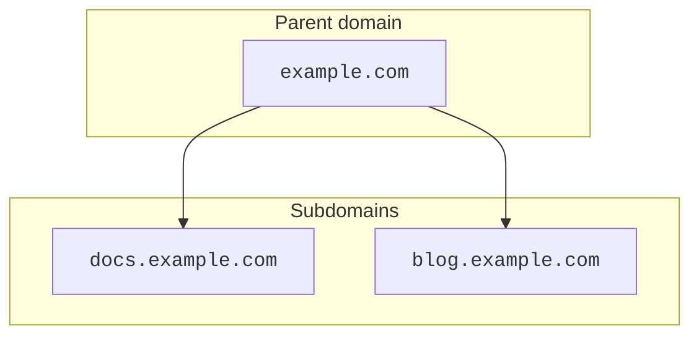

import { DirectoryListing, GlossaryTooltip, Render } from "~/components";

:::note[Availability]
Subdomain setup is only available for Enterprise accounts. If you only want to create a subdomain for your site in Cloudflare, refer to [Create a subdomain record](/dns/manage-dns-records/how-to/create-subdomain/).
:::

[Subdomain setup](/dns/zone-setups/subdomain-setup/) relies on a process known as delegation. When, in a parent domain such as `example.com`, an [NS record](https://www.cloudflare.com/learning/dns/dns-records/dns-ns-record/) is created for a subdomain `blog.example.com`, this means that DNS management for the subdomain can be done separately, in its own <GlossaryTooltip term="DNS zone" link="/dns/concepts/#zone">DNS zone</GlossaryTooltip>.

---

## Available setups

<Render file="subdomain-setup-matrix" product="dns" />

:::caution[Subdomain zones in partial setup are not delegated]

Subdomains using a CNAME setup (partial) represent an exception in the sense that delegation does not apply in this context. As explained in the dedicated [CNAME setup (Partial) section](/dns/zone-setups/partial-setup/), this setup is intended to simply proxy individual subdomains through Cloudflare. For completeness, however, this is listed as an option in this table and the [how-to guide](/dns/zone-setups/subdomain-setup/setup/parent-on-partial/) has detailed explanation on how to achieve a subdomain zone using a CNAME setup (partial).
:::

This table assumes zones that are in an [active status](/dns/zone-setups/reference/domain-status/). For example, if you need to add the parent zone to Cloudflare when its child zone already exists in a CNAME setup (partial), you can [convert the parent zone to a CNAME setup (partial)](/dns/zone-setups/partial-setup/setup/#1-convert-your-zone-and-review-dns-records) while it is still in pending status.

---

## How to

Refer to the following guides to learn how to configure a subdomain setup depending on the setup used for the parent zone:

<DirectoryListing />

Although the how-to guides in this documentation are focused on both parent domains and subdomains existing in Cloudflare, it is also possible to achieve a subdomain setup in Cloudflare while the parent domain exists in a different DNS provider.

---

## SSL/TLS certificates

When using subdomain setup, you should consider possible interactions between parent zone and child zone configurations that could impact [SSL/TLS certificates](/ssl/) provisioning.

If a certificate is already active on the child zone for a specific hostname (`subdomain.example.com`), any certificate pack containing that exact hostname in the parent zone (`example.com`) will fail validation.

## Access applications

<Render file="subdomain-setup-access-apps" product="dns" />
