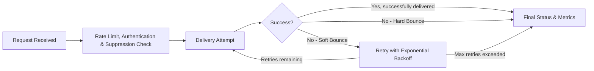
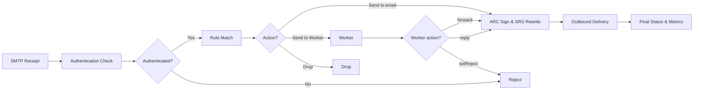

The email lifecycle describes the complete journey of an email through Cloudflare Email Service. Understanding this process helps you optimize your email implementation and troubleshoot delivery issues.

Email Sending and Email Routing follow distinct processing pipelines. The outbound flow covers emails you send through the service; the inbound flow covers emails received on domains configured with Email Routing.

## Outbound flow (Email Sending)

Every email sent through Cloudflare Email Service follows this processing pipeline:

### Stage details

1. **Request received:** The system validates the email format, sender authorization, and message structure. Invalid requests are rejected immediately and do not proceed to the next stage.

2. **Rate limit check:** The system checks sending [limits](/email-service/platform/limits/) per account, domain, and recipient to prevent abuse. Requests that exceed these limits are temporarily rejected and must be retried later.

3. **Authentication and reputation**: The system performs email authentication checks and evaluates sender reputation:
   - **SPF (Sender Policy Framework)**: Verifies that the sending IP address is authorized to send emails for the domain by checking DNS TXT records. This prevents domain spoofing and improves deliverability.
   - **DKIM (DomainKeys Identified Mail)**: Validates the email's cryptographic signature to ensure message integrity and authenticate the sender domain. This builds trust with recipient servers.
   - **DMARC (Domain-based Message Authentication)**: Applies domain owner policies for handling emails that fail SPF or DKIM checks, helping prevent phishing and brand impersonation while providing feedback reports.

   These authentication mechanisms work together to establish sender legitimacy and protect against email fraud. Senders with low reputation scores may experience throttling or delayed processing.

4. **Suppression list check:** The system checks the recipient against your account's suppression list, which includes bounces, complaints, and unsubscribes. Recipients found on this list are blocked from receiving the email.

5. **Delivery attempt:** The system connects to the recipient's mail server and attempts message delivery via SMTP. When delivery fails, the system applies different retry logic based on the failure type:
   - **Soft bounces (4xx responses)**: The system retries delivery using exponential backoff timing
   - **Hard bounces (5xx responses)**: The system marks the email as permanently failed with no retry attempts

6. **Server response handling:** The system processes SMTP response codes from the recipient server to determine the final email status:
   - **2xx codes**: The email was delivered successfully
   - **4xx codes**: Temporary failure occurred and the email will be retried
   - **5xx codes**: Permanent failure occurred and the email cannot be delivered

7. **Final status and metrics:** Based on the server response, the system assigns emails one of these final statuses:
   - **Delivered**: The email was successfully accepted by the recipient server
   - **Delivery failed**: The email permanently failed delivery (hard bounce) or exceeded the maximum retry attempts (soft bounce). This status appears as `deliveryFailed` when querying the [GraphQL Analytics API](/email-service/observability/metrics-analytics/).

## Inbound flow (Email Routing)

Every email received on a domain configured with Email Routing follows this processing pipeline:

### Stage details

1. **SMTP receipt:** A sending server connects to a Cloudflare MX server and submits the message over SMTP. Messages larger than the [inbound message size limit](/email-service/platform/limits/) are rejected at this stage.

2. **Authentication check:** The system performs [SPF, DKIM, DMARC, and ARC](/email-service/concepts/email-authentication/) checks on the incoming message. Mail that fails authentication according to the sender's DMARC policy is rejected. Mail from IP addresses on a Realtime Block List is also rejected at this stage. Refer to [Postmaster information](/email-service/reference/postmaster/) for details.

3. **Rule match:** The system matches the recipient address against your configured [routing rules](/email-service/configuration/email-routing-addresses/). If [subaddressing](/email-service/configuration/email-routing-addresses/#subaddressing) is enabled, sub-addressed recipients fall back to the base routing rule. If no rule matches and the [catch-all rule](/email-service/configuration/email-routing-addresses/#catch-all-rule) is enabled, the catch-all rule applies.

4. **Action:** The system applies the matched rule's action:
   - **Send to an email**: The message is forwarded to the verified destination address (stage 5).
   - **Send to a Worker**: The message is passed to your [Worker](/email-service/api/route-emails/email-handler/). The Worker can call `forward()`, `reply()`, or `setReject()`.
   - **Drop**: The message is silently discarded. No further processing occurs.

5. **ARC sign and SRS rewrite:** For forwarded messages, the system adds an ARC seal preserving the original authentication results and rewrites the envelope sender using the [Sender Rewriting Scheme](/email-service/reference/postmaster/#sender-rewriting). This allows SPF to pass at the destination server.

6. **Outbound delivery:** The system connects to the destination mail server and delivers the message. Soft bounces are retried with exponential backoff. Hard bounces are returned to the original sender in-session as upstream SMTP errors. Refer to [Postmaster: SMTP errors](/email-service/reference/postmaster/#smtp-errors).

7. **Final status and metrics:** The final outcome is recorded and available through the [Activity log](/email-service/observability/logs/) and the [GraphQL Analytics API](/email-service/observability/metrics-analytics/).
