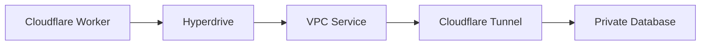

import { Render, Tabs, TabItem } from "~/components";

[Workers VPC](/workers-vpc/) provides a way to connect Hyperdrive to a private database without configuring Cloudflare Access applications or service tokens. Instead, you create a TCP [VPC Service](/workers-vpc/configuration/vpc-services/) that points to your database and pass its service ID to Hyperdrive.

For the Tunnel and Access approach, refer to [Connect to a private database using Tunnel](/hyperdrive/configuration/connect-to-private-database/).

## How it works

When your database is isolated within a private network (such as a [virtual private cloud](https://www.cloudflare.com/learning/cloud/what-is-a-virtual-private-cloud) or an on-premise network), you must enable a secure connection from your network to Cloudflare.

- [Cloudflare Tunnel](/cloudflare-one/networks/connectors/cloudflare-tunnel/) is used to establish a secure outbound connection from your private network to Cloudflare.
- A [VPC Service](/workers-vpc/configuration/vpc-services/) is used to route traffic from your Worker through the tunnel to your database, without requiring Cloudflare Access applications or service tokens.

A request from the Cloudflare Worker to the origin database goes through Hyperdrive, the VPC Service, and the Cloudflare Tunnel established by `cloudflared`. `cloudflared` must be running in the private network in which your database is accessible.



<Render file="tutorials-before-you-start" product="workers" />

## Prerequisites

- A database in your private network, [configured to use TLS/SSL](/hyperdrive/examples/connect-to-postgres/#supported-tls-ssl-modes).
- A [Cloudflare Tunnel](/workers-vpc/configuration/tunnel/) running in a network that can reach your database.
- The **Connectivity Directory Admin** role on your Cloudflare account to create VPC Services.

## 1. Set up a Cloudflare Tunnel

If you do not already have a tunnel running in the same network as your database, create one.

<Render file="create-tunnel-steps" product="workers-vpc" />

The tunnel must be able to reach your database host and port from within the private network.

For full tunnel documentation, refer to [Cloudflare Tunnel for Workers VPC](/workers-vpc/configuration/tunnel/).

## 2. Create a TCP VPC Service

Create a VPC Service of type `tcp` that points to your database. Set the `--app-protocol` flag to `postgresql` or `mysql` so that Hyperdrive can optimize connections.

<Tabs>
<TabItem label="PostgreSQL">

```sh
npx wrangler vpc service create my-postgres-db \
  --type tcp \
  --tcp-port 5432 \
  --app-protocol postgresql \
  --tunnel-id <YOUR_TUNNEL_ID> \
  --ipv4 <YOUR_DATABASE_IP>
```

</TabItem>
<TabItem label="MySQL">

```sh
npx wrangler vpc service create my-mysql-db \
  --type tcp \
  --tcp-port 3306 \
  --app-protocol mysql \
  --tunnel-id <YOUR_TUNNEL_ID> \
  --ipv4 <YOUR_DATABASE_IP>
```

</TabItem>
</Tabs>

Replace:

- `<YOUR_TUNNEL_ID>` with the tunnel ID from step 1.
- `<YOUR_DATABASE_IP>` with the private IP address of your database (for example, `10.0.0.5`). You can also use `--hostname` with a DNS name instead of `--ipv4`.

The command will return a service ID. Save this value for the next step.

You can also create a TCP VPC Service from the [Workers VPC dashboard](https://dash.cloudflare.com/?to=/:account/workers/vpc). Refer to [VPC Services](/workers-vpc/configuration/vpc-services/) for all configuration options.

### TLS certificate verification

Unlike Hyperdrive, which does not verify the origin server certificate by default, Workers VPC defaults to `verify_full` — it verifies both the certificate chain and the hostname. If your database uses a self-signed certificate or a certificate from a private certificate authority (CA), the TLS handshake will fail unless you adjust the verification mode.

For databases with self-signed certificates, add `--cert-verification-mode` when creating the VPC Service:

- `verify_ca` — Verifies the certificate chain but skips hostname verification. Use this when your database has a certificate signed by a CA you control but the hostname does not match the certificate.
- `disabled` — Skips certificate verification entirely. Use this only for development or testing.

For example, to create a VPC Service for a PostgreSQL database with a self-signed certificate:

```sh
npx wrangler vpc service create my-postgres-db \
  --type tcp \
  --tcp-port 5432 \
  --app-protocol postgresql \
  --tunnel-id <YOUR_TUNNEL_ID> \
  --ipv4 <YOUR_DATABASE_IP> \
  --cert-verification-mode verify_ca
```

To update an existing VPC Service, use `wrangler vpc service update` with the same flag.

:::note
Workers VPC trusts publicly trusted certificates and [Cloudflare Origin CA certificates](/ssl/origin-configuration/origin-ca/). Uploading a custom CA certificate to Workers VPC is not supported yet. If your database uses a certificate signed by a private CA, set `--cert-verification-mode` to `verify_ca` or `disabled` until custom CA support is available.
:::

For the full list of verification modes, refer to [TLS certificate verification mode](/workers-vpc/configuration/vpc-services/#tls-certificate-verification-mode).

## 3. Create a Hyperdrive configuration

Use the `--service-id` flag to point Hyperdrive at the VPC Service you created. When you use `--service-id`, you do not provide `--origin-host`, `--origin-port`, or `--connection-string`. Hyperdrive routes traffic through the VPC Service instead.

<Tabs>
<TabItem label="PostgreSQL">

```sh
npx wrangler hyperdrive create <YOUR_CONFIG_NAME> \
  --service-id <YOUR_VPC_SERVICE_ID> \
  --database <DATABASE_NAME> \
  --user <DATABASE_USER> \
  --password <DATABASE_PASSWORD> \
  --scheme postgresql
```

</TabItem>
<TabItem label="MySQL">

```sh
npx wrangler hyperdrive create <YOUR_CONFIG_NAME> \
  --service-id <YOUR_VPC_SERVICE_ID> \
  --database <DATABASE_NAME> \
  --user <DATABASE_USER> \
  --password <DATABASE_PASSWORD> \
  --scheme mysql
```

</TabItem>
</Tabs>

Replace:

- `<YOUR_VPC_SERVICE_ID>` with the service ID from step 2.
- `<DATABASE_NAME>` with the name of your database.
- `<DATABASE_USER>` and `<DATABASE_PASSWORD>` with your database credentials.

If successful, the command will output a Hyperdrive configuration with an `id` field. Copy this ID for the next step.

:::note
The `--service-id` flag conflicts with `--origin-host`, `--origin-port`, `--connection-string`, `--access-client-id`, and `--access-client-secret`. You cannot combine these options. To update an existing Hyperdrive configuration to use a VPC Service, run `wrangler hyperdrive update` with the `--service-id` flag.
:::

## 4. Bind Hyperdrive to a Worker

<Render file="create-hyperdrive-binding" product="hyperdrive" />

## 5. Query the database

<Tabs>
<TabItem label="PostgreSQL">

Use [node-postgres](https://node-postgres.com/) (`pg`) to send a test query.

<Render file="use-node-postgres-to-make-query" product="hyperdrive" />

Deploy your Worker:

```sh
npx wrangler deploy
```

If you receive a list of `pg_tables` from your database when you access your deployed Worker, Hyperdrive is connected to your private database through Workers VPC.

</TabItem>
<TabItem label="MySQL">

Use [mysql2](https://github.com/sidorares/node-mysql2) to send a test query.

<Render file="use-mysql2-to-make-query" product="hyperdrive" />

Deploy your Worker:

```sh
npx wrangler deploy
```

If you receive a list of tables from your database when you access your deployed Worker, Hyperdrive is connected to your private database through Workers VPC.

</TabItem>
</Tabs>

## Next steps

- Learn more about [how Hyperdrive works](/hyperdrive/concepts/how-hyperdrive-works/).
- Configure [query caching](/hyperdrive/concepts/query-caching/) for Hyperdrive.
- Review [VPC Service configuration options](/workers-vpc/configuration/vpc-services/) including TLS certificate verification.
- Set up [high availability tunnels](/workers-vpc/configuration/tunnel/hardware-requirements/) for production workloads.
- [Troubleshoot common issues](/hyperdrive/observability/troubleshooting/) when connecting a database to Hyperdrive.
