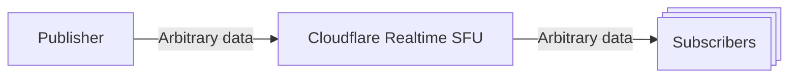

DataChannels are a way to send arbitrary data, not just audio or video data, between client in low latency. DataChannels are useful for scenarios like chat, game state, or any other data that doesn't need to be encoded as audio or video but still needs to be sent between clients in real time.

While it is possible to send audio and video over DataChannels, it's not optimal because audio and video transfer includes media specific optimizations that DataChannels do not have, such as simulcast, forward error correction, better caching across the Cloudflare network for retransmissions.



DataChannels on Cloudflare Realtime can scale up to many subscribers per publisher, there is no limit to the number of subscribers per publisher.

### How to use DataChannels

1. Create  two Realtime sessions, one for the publisher and one for the subscribers.
2. Create a DataChannel by calling /datachannels/new with the location set to "local" and the dataChannelName set to the name of the DataChannel.
3. Create a DataChannel by calling /datachannels/new with the location set to "remote" and the sessionId set to the sessionId of the publisher.
4. Use the DataChannel to send data from the publisher to the subscribers.

### Subscriber acknowledgment gate (waitForAck)

By default, a subscriber starts receiving messages as soon as it pulls a remote DataChannel. To avoid losing the first messages before your subscriber is ready to handle them, you can opt in to an acknowledgment gate for each subscriber.

- Set `waitForAck: true` when you create a remote DataChannel with the [HTTPS API](/realtime/sfu/https-api/). While the gate is closed, the SFU does not forward any messages to that subscriber on that DataChannel.
- After the subscriber's DataChannel opens, have the subscriber send any message on it (for example, the string `"ack"`). The first message opens the gate, and the SFU starts forwarding messages to that subscriber.
- The acknowledgment is consumed by the SFU. It is not forwarded to the publisher or to other subscribers, so the channel stays [unidirectional](#unidirectional-datachannels).
- The acknowledgment must reach the SFU within 15 seconds of creating the remote DataChannel. If it does not, the SFU tears down the gated channel and forwards no messages; create the remote DataChannel again to retry.
- `waitForAck` applies only to `location: "remote"` DataChannels and defaults to `false`, so existing behavior is unchanged.

Create a remote DataChannel with the gate enabled by calling `POST /apps/{appId}/sessions/{sessionId}/datachannels/new` on the subscriber session:

```json
{
  "dataChannels": [
    {
      "location": "remote",
      "sessionId": "<publisherSessionId>",
      "dataChannelName": "my-channel",
      "waitForAck": true
    }
  ]
}
```

Then, on the subscriber, send the acknowledgment once the DataChannel is open:

```ts
const resp = await fetch(`${API_BASE}/sessions/${subscriberId}/datachannels/new`, {
  method: "POST",
  headers,
  body: JSON.stringify({
    dataChannels: [
      {
        location: "remote",
        sessionId: publisherId,
        dataChannelName: "my-channel",
        waitForAck: true,
      },
    ],
  }),
}).then((r) => r.json());

const dc = pc.createDataChannel("my-channel-subscribed", {
  negotiated: true,
  id: resp.dataChannels[0].id,
});

await waitForOpen(dc);
dc.send("ack"); // The first frame opens the gate; later frames are your application data.
```

### Unidirectional DataChannels

Cloudflare Realtime SFU DataChannels are one way only. This means that you can only send data from the publisher to the subscribers. Subscribers cannot send data back to the publisher. While regular MediaStream WebRTC DataChannels are bidirectional, this introduces a problem for Cloudflare Realtime because the SFU does not know which session to send the data back to. This is especially problematic for scenarios where you have multiple subscribers and you want to send data from the publisher to all subscribers at scale, such as distributing game score updates to all players in a multiplayer game.

To send data in a bidirectional way, you can use two DataChannels, one for sending data from the publisher to the subscribers and one for sending data the opposite direction.

## Example

An example of DataChannels in action can be found in the [Realtime Examples github repo](https://github.com/cloudflare/calls-examples/tree/main/echo-datachannels).
