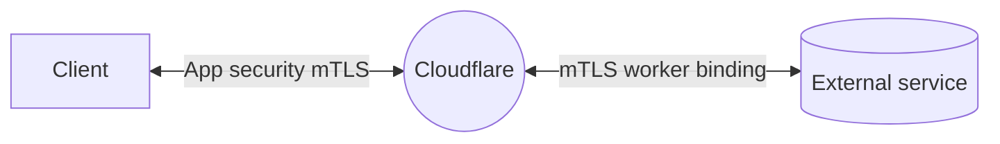

import { GlossaryDefinition, Render, DirectoryListing } from "~/components";

Standard TLS verifies the server's identity to the client. Mutual TLS (mTLS) adds a second check: the server also verifies the client's identity using a client certificate. This allows you to restrict access to devices or services that present a valid certificate.

Use Cloudflare's public key infrastructure (PKI) to create client certificates, or [bring your own CA (BYOCA)](/ssl/client-certificates/byo-ca/).

<GlossaryDefinition term="mTLS (mutual TLS)" />

:::note[mTLS at Cloudflare]
This documentation is focused on the SSL/TLS product. For a broader overview, refer to the [mTLS at Cloudflare learning path](/learning-paths/mtls/concepts/).
:::

---

## How it works

When a hostname has [mTLS enabled](/ssl/client-certificates/enable-mtls/), Cloudflare requires connecting clients to present a valid certificate. Client certificates are installed on the devices or services that should be granted access.

Cloudflare validates client certificates against CAs set at the account level. Because validation is account-level, the same certificates work across multiple domains under your account, as long as mTLS is enabled for each hostname (for example, `host.example.com`, `name.example.net`, `secure.anotherdomain.test`).

The account-level CAs can be:

- The Cloudflare-managed CA: This is the default option. Certificates and hostname associations are listed on the **Cloudflare-issued** tab of the [Client Certificates dashboard](https://dash.cloudflare.com/?to=/:account/:zone/ssl-tls/client-certificates/).
- [BYOCA](/ssl/client-certificates/byo-ca/) certificates: Available on Enterprise accounts. Certificates and hostname associations are listed on the **BYOCA** tab of the [Client Certificates dashboard](https://dash.cloudflare.com/?to=/:account/:zone/ssl-tls/client-certificates/).

Cloudflare then stores the validation result in a field called [`cf.tls_client_auth.cert_verified`](/ruleset-engine/rules-language/fields/reference/cf.tls_client_auth.cert_verified/):

- **Success**: `cf.tls_client_auth.cert_verified` is `true`, and you can find client certificate details in [specific mTLS fields](/ruleset-engine/rules-language/fields/reference/?search-term=cf.tls_client_auth).
- **Failure**: `cf.tls_client_auth.cert_verified` is `false`.

---

## Use cases

mTLS supports several implementation patterns depending on what you are protecting. For a broader overview, refer to the [mTLS learning path](/learning-paths/mtls/concepts/).

- [Application security](/learning-paths/mtls/mtls-app-security/) — restrict access to your web application based on client certificates
- [mTLS for Zero Trust](/cloudflare-one/access-controls/service-credentials/mutual-tls-authentication/) — authenticate users and services through Cloudflare Access
- [mTLS with API Shield](/api-shield/security/mtls/configure/) — validate API clients with certificate-based authentication
- [mTLS Workers binding](/workers/runtime-apis/bindings/mtls/) — present a client certificate when your Worker connects to an external service

Apart from the mTLS Workers binding, any of the above implementations can use your own CA instead of the Cloudflare-managed one. Refer to [Bring your own CA](/ssl/client-certificates/byo-ca/).

### mTLS and Workers

Use the [mTLS Workers binding](/workers/runtime-apis/bindings/mtls/) when you need your worker to present a client certificate to an external service. To authenticate requests from a client to your worker instead, refer to the regular [mTLS for application security](/learning-paths/mtls/mtls-app-security/) implementation.

---

## Further resources

<DirectoryListing />
