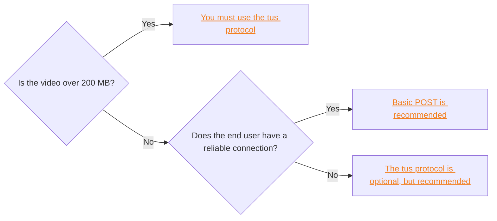
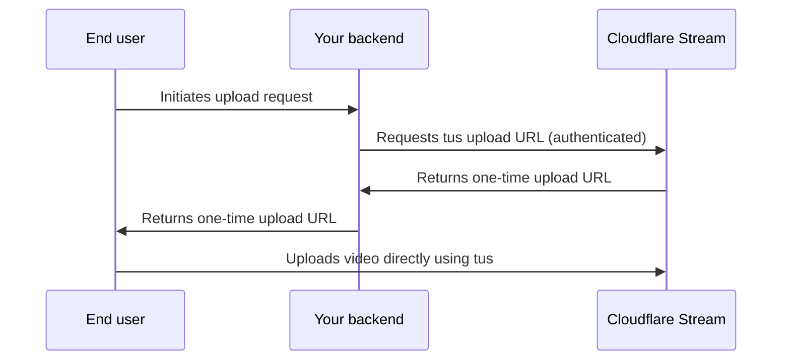

import { Tabs, TabItem } from "~/components";

Direct creator uploads let your end users upload videos directly to Cloudflare Stream without exposing your API token to clients. You can implement direct creator uploads using either a [basic POST request](#basic-post-request) or the [tus protocol](#direct-creator-uploads-with-tus-protocol). Use this chart to decide which method to use:



:::note[Billing considerations]

Whether you use basic `POST` or tus protocol, you must specify a maximum duration to reserve for the user's upload to ensure it can be accommodated within your available storage. This duration will be deducted from your account's available storage until the user's upload is received. Once the upload is processed, its actual duration will be counted and the remaining reservation will be released. If the video errors or is not received before the link expires, the entire reservation will be released.

For a detailed breakdown of pricing and example scenarios, refer to [Pricing](/stream/pricing/).

:::

## Basic POST request

If your end user's video is under 200 MB and their connection is reliable, we recommend using this method. If your end user's connection is unreliable, we recommend using the [tus protocol](#direct-creator-uploads-with-tus-protocol) instead.

To enable direct creator uploads with a `POST` request:

### Step 1: Generate a unique, one-time upload URL

<Tabs>
<TabItem label="REST API">

Generate a unique, one-time upload URL using the [Direct upload API](/api/resources/stream/subresources/direct_upload/methods/create/).

```sh title="Generate upload"
curl https://api.cloudflare.com/client/v4/accounts/{account_id}/stream/direct_upload \
--header 'Authorization: Bearer <API_TOKEN>' \
 --data '{
    "maxDurationSeconds": 3600
 }'
```

{/* <!-- videodelivery.net is correct domain. See STREAM-4364 --> */}

```json output {3}
{
	"result": {
		"uploadURL": "https://upload.videodelivery.net/f65014bc6ff5419ea86e7972a047ba22",
		"uid": "f65014bc6ff5419ea86e7972a047ba22"
	},
	"success": true,
	"errors": [],
	"messages": []
}
```

See the full Stream [REST API and SDK reference](/api/resources/stream/) for details on using REST API from external applications, with pre-generated SDK's for external TypeScript, Python, or Go applications.

</TabItem>
<TabItem label="Workers Binding API">
	<Tabs>
	<TabItem label="index.ts">

:::note

Currently, the Workers Binding API creates a basic POST direct upload URL. For TUS protocol uploads (necessary for files over 200MB), use the REST API approach shown below.

:::

```ts
export default {
	async fetch(request, env, ctx): Promise<Response> {
		const directUpload = await env.STREAM.createDirectUpload({
			maxDurationSeconds: 3600,
		});

		return new Response(JSON.stringify(directUpload));
	},
} satisfies ExportedHandler<{ STREAM: StreamBinding }>;
```
	</TabItem>
	<TabItem label="wrangler.jsonc">
```json
{
	"$schema": "node_modules/wrangler/config-schema.json",
	"name": "<ENTER_WORKER_NAME>",
	"main": "src/index.ts",
	"compatibility_date": "$today",
	"observability": {
		"enabled": true
	},
	"stream": {
		"binding": "STREAM"
	}
}
```
	</TabItem>
	</Tabs>

See the full [Workers Stream binding API reference](/stream/manage-video-library/bindings/).

</TabItem>
</Tabs>

### Step 2: Upload the video to the one-time URL

With the `uploadURL` from the previous step, users can upload video files that are limited to 200 MB in size. Refer to the example request below.

{/* <!-- videodelivery.net is correct domain. See STREAM-4364 --> */}

```bash {3} title="Upload a video to the unique one-time upload URL"
curl --request POST \
  --form file=@/Users/mickie/Downloads/example_video.mp4 \
  https://upload.videodelivery.net/f65014bc6ff5419ea86e7972a047ba22
```

A successful upload returns a `200` HTTP status code response. If the upload does not meet
the upload constraints defined at time of creation or is larger than 200 MB in size, the response returns a `4xx` HTTP status code.

## Direct creator uploads with tus protocol

If your end user's video is over 200 MB, you must use the tus protocol. Even if the file is under 200 MB, if the end user's connection is potentially unreliable, Cloudflare recommends using the tus protocol because it is resumable. For detailed information about tus protocol requirements, additional client examples, and upload options, refer to [Resumable and large files (tus)](/stream/uploading-videos/resumable-uploads/).

The following diagram shows how the two steps of this process interact:



### Step 1: Your backend provisions a one-time upload URL

:::note

Before provisioning the one-time upload URL, your backend must obtain the file size from the end user. The tus protocol requires the `Upload-Length` header when creating the upload endpoint. In a browser, you can get the file size from the selected file's `.size` property (for example, `fileInput.files[0].size`).

:::

The example below shows how to build a Worker that returns a one-time upload URL to your end users. For tus protocol uploads, your backend must pass the `Tus-Resumable`, `Upload-Length`, and `Upload-Metadata` headers. The one-time upload URL is returned in the `Location` header of the response, not in the response body.

```javascript title="Example tus API endpoint"
export async function onRequest(context) {
	const { request, env } = context;
	const { CLOUDFLARE_ACCOUNT_ID, CLOUDFLARE_API_TOKEN } = env;
	const endpoint = `https://api.cloudflare.com/client/v4/accounts/${CLOUDFLARE_ACCOUNT_ID}/stream?direct_user=true`;

	const response = await fetch(endpoint, {
		method: "POST",
		headers: {
			Authorization: `bearer ${CLOUDFLARE_API_TOKEN}`,
			"Tus-Resumable": "1.0.0",
			"Upload-Length": request.headers.get("Upload-Length"),
			"Upload-Metadata": request.headers.get("Upload-Metadata"),
		},
	});

	const destination = response.headers.get("Location");

	return new Response(null, {
		headers: {
			"Access-Control-Expose-Headers": "Location",
			"Access-Control-Allow-Headers": "*",
			"Access-Control-Allow-Origin": "*",
			Location: destination,
		},
	});
}
```

### Step 2: Your end user's client uploads directly to Stream

Use your backend endpoint directly in your tus client. Refer to the below example for a complete demonstration of how to use the backend from Step 1 with the uppy tus client.

```html {35} title="Upload a video using the uppy tus client"
<html>
	<head>
		<link
			href="https://releases.transloadit.com/uppy/v3.0.1/uppy.min.css"
			rel="stylesheet"
		/>
	</head>
	<body>
		<div id="drag-drop-area" style="height: 300px"></div>
		<div class="for-ProgressBar"></div>
		<button class="upload-button" style="font-size: 30px; margin: 20px">
			Upload
		</button>
		<div class="uploaded-files" style="margin-top: 50px">
			<ol></ol>
		</div>
		<script type="module">
			import {
				Uppy,
				Tus,
				DragDrop,
				ProgressBar,
			} from "https://releases.transloadit.com/uppy/v3.0.1/uppy.min.mjs";

			const uppy = new Uppy({ debug: true, autoProceed: true });

			const onUploadSuccess = (el) => (file, response) => {
				const li = document.createElement("li");
				const a = document.createElement("a");
				a.href = response.uploadURL;
				a.target = "_blank";
				a.appendChild(document.createTextNode(file.name));
				li.appendChild(a);

				document.querySelector(el).appendChild(li);
			};

			uppy
				.use(DragDrop, { target: "#drag-drop-area" })
				.use(Tus, {
					endpoint: "/api/get-upload-url",
					chunkSize: 150 * 1024 * 1024,
				})
				.use(ProgressBar, {
					target: ".for-ProgressBar",
					hideAfterFinish: false,
				})
				.on("upload-success", onUploadSuccess(".uploaded-files ol"));

			const uploadBtn = document.querySelector("button.upload-button");
			uploadBtn.addEventListener("click", () => uppy.upload());
		</script>
	</body>
</html>
```

For more details on using tus and example client code, refer to [Resumable and large files (tus)](/stream/uploading-videos/resumable-uploads/).

## Upload-Metadata header syntax

You can apply the [same constraints](/api/resources/stream/subresources/direct_upload/methods/create/) as Direct Creator Upload via basic upload when using tus. To do so, you must pass the `expiry` and `maxDurationSeconds` as part of the `Upload-Metadata` request header as part of the first request (made by the Worker in the example above.) The `Upload-Metadata` values are ignored from subsequent requests that do the actual file upload.

The `Upload-Metadata` header should contain key-value pairs. The keys are text and the values should be encoded in base64. Separate the key and values by a space, _not_ an equal sign. To join multiple key-value pairs, include a comma with no additional spaces.

In the example below, the `Upload-Metadata` header is instructing Stream to only accept uploads with max video duration of 10 minutes, uploaded prior to the expiry timestamp, and to make this video private:

`'Upload-Metadata: maxDurationSeconds NjAw,requiresignedurls,expiry MjAyNC0wMi0yN1QwNzoyMDo1MFo='`

`NjAw` is the base64 encoded value for "600" (or 10 minutes).

`MjAyNC0wMi0yN1QwNzoyMDo1MFo=` is the base64 encoded value for "2024-02-27T07:20:50Z" (an RFC3339 format timestamp)

## Track upload progress

After the creation of a unique one-time upload URL, you should retain the unique identifier (`uid`) returned in the response to track the progress of a user's upload.

You can track upload progress in the following ways:

- [Use the get video details API endpoint](/api/resources/stream/methods/get/) with the `uid`.

- [Create a webhook subscription](/stream/manage-video-library/using-webhooks/) to receive notifications about the video status. These notifications include the `uid`.
