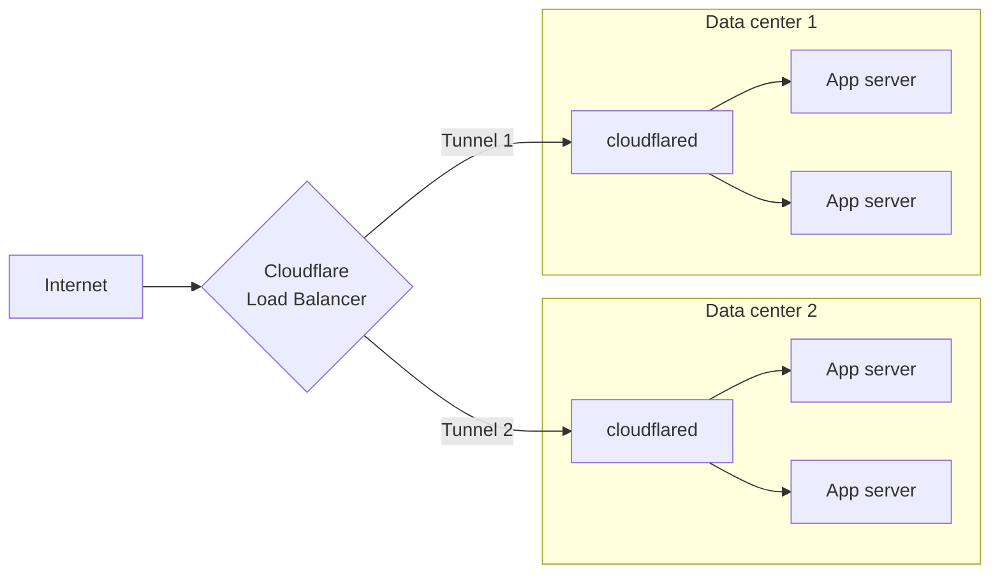

import { TabItem, Tabs, DashButton, Details, Render } from "~/components";

Cloudflare Tunnel routes traffic from Cloudflare's network to services running behind `cloudflared`. When you [publish an application](/tunnel/setup/#publish-an-application), you map a public hostname to a local service — for example, `app.example.com` to `http://localhost:8080` — and Cloudflare applies CDN caching, WAF, and DDoS protection before forwarding the request to your origin.

## Published applications

A published application is a hostname-to-service mapping defined in your tunnel configuration. Each mapping tells `cloudflared` which local service should receive traffic for a given public hostname.

You can publish multiple applications on a single tunnel. For each application, specify:

- **Public hostname** — The domain or subdomain that users visit (for example, `app.example.com`).
- **Service** — The local address or socket where the application is running (for example, `http://localhost:8080`).

When you add a route through the dashboard, Cloudflare automatically creates a DNS record pointing the hostname to your tunnel subdomain (`<UUID>.cfargotunnel.com`).

## Supported protocols

<Render
  file="tunnel/protocols-table"
  product="cloudflare-one"
  params={{
    disableTlsVerificationURL: "/tunnel/configuration/#notlsverify",
    locallyManagedTunnelsURL: "/tunnel/other-tunnel-types/local-management/configuration-file/#file-structure-for-published-applications"
  }}
/>

## DNS records

<Render file="tunnel/dns-records-intro" product="cloudflare-one" />

### Create a DNS record

<Render
  file="tunnel/dns-records-create"
  product="cloudflare-one"
  params={{
    certPemURL: "/tunnel/other-tunnel-types/local-management/local-tunnel-terms/#certpem"
  }}
/>

## Load balancing

Use a [public load balancer](/load-balancing/load-balancers/) to distribute traffic across servers running your published applications. This provides health-check-based failover and intelligent traffic steering across regions.

### Replicas versus load balancers

Running multiple `cloudflared` [replicas](/tunnel/configuration/#replicas-and-high-availability) on the same tunnel UUID provides basic redundancy — if one host fails, other replicas continue serving traffic. However, the load balancer treats all replicas of the same tunnel UUID as a single endpoint.

For granular traffic steering and [session affinity](/load-balancing/understand-basics/session-affinity/), connect each host using a different tunnel UUID so the load balancer can address them independently.

### Add a tunnel to a load balancer pool

:::note[Prerequisites]
A Cloudflare Tunnel with at least one [published application route](/tunnel/setup/#publish-an-application).
:::

<Render
  file="tunnel/availability/load-balancer-create"
  product="cloudflare-one"
  params={{
    publishedAppRouteURL: "/tunnel/setup/#publish-an-application",
    tunnelIdLocation: "the [Cloudflare dashboard](https://dash.cloudflare.com/) under **Networking** > **Tunnels**"
  }}
/>

<Render
  file="tunnel/availability/load-balancer-tcp-monitors"
  product="cloudflare-one"
  params={{
    publishedAppRouteURL: "/tunnel/setup/#publish-an-application"
  }}
/>

<Render
  file="tunnel/availability/load-balancer-local-connection"
  product="cloudflare-one"
  params={{
    replicasURL: "/tunnel/configuration/#replicas-and-high-availability"
  }}
/>

## Cloudflare settings

<Render file="tunnel/dns-cloudflare-settings" product="cloudflare-one" />
