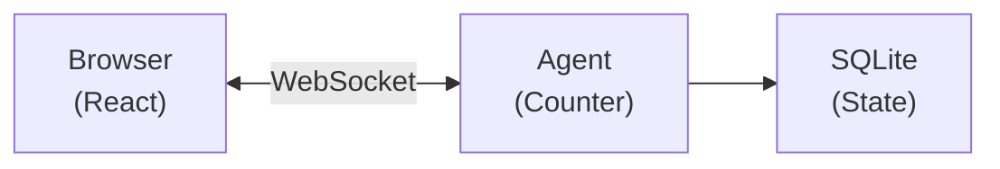

---
{}
---

## How it works

When you clicked the button:

1. **Client** called `agent.stub.increment()` over WebSocket
2. **Agent** ran `increment()`, updated state with `setState()`
3. **State** persisted to SQLite automatically
4. **Broadcast** sent to all connected clients
5. **React** updated via `onStateUpdate`

### Key concepts

| Concept              | What it means                                                                                         |
| -------------------- | ----------------------------------------------------------------------------------------------------- |
| **Agent instance**   | Each unique name gets its own agent. `CounterAgent:user-123` is separate from `CounterAgent:user-456` |
| **Persistent state** | State survives restarts, deploys, and hibernation. It is stored in SQLite                             |
| **Real-time sync**   | All clients connected to the same agent receive state updates instantly                               |
| **Hibernation**      | When no clients are connected, the agent hibernates (no cost). It wakes on the next request           |
